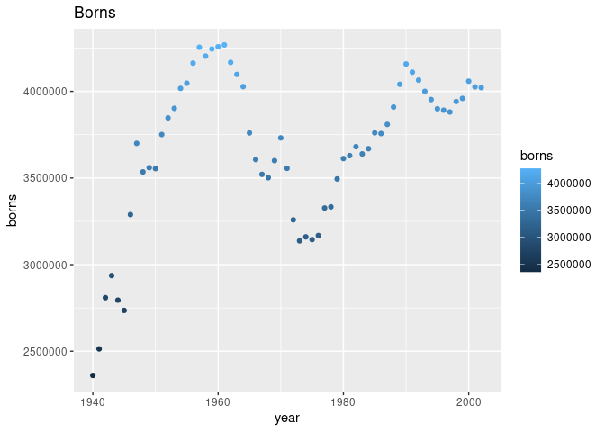

    #install.packages("ggplot2")
    #install.packages("dplyr")
    #install.packages("gridExtra")
    library(ggplot2)
    library(dplyr, warn.conflicts = FALSE)
    library("gridExtra")

    ## 
    ## Attaching package: 'gridExtra'

    ## The following object is masked from 'package:dplyr':
    ## 
    ##     combine

<table>
<tbody>
<tr class="odd">
<td>Disciplina</td>
<td>CD001-Estatística</td>
</tr>
<tr class="even">
<td>Professora</td>
<td>Lisiane Selau</td>
</tr>
<tr class="odd">
<td>Aluno</td>
<td>Strauss Cunha Carvalho</td>
</tr>
<tr class="even">
<td>Data</td>
<td>10/03/2022</td>
</tr>
</tbody>
</table>

#### **Laboratórios 0 e 1**

Nas páginas anteriores, você recriou algumas das exposições e análises
preliminares dos dados de batismo de Arbuthnot. Sua tarefa consiste
repetir essas etapas, mas para os registros atuais de nascimento dos
Estados Unidos.

Carregue os dados atuais com o seguinte comando.

\[openinto\] (“<http://www.openintro.org/stat/data/present.R>”)

    source("http://www.openintro.org/stat/data/present.R")
    source("http://www.openintro.org/stat/data/arbuthnot.R")

    str(present)

    ## 'data.frame':    63 obs. of  3 variables:
    ##  $ year : num  1940 1941 1942 1943 1944 ...
    ##  $ boys : num  1211684 1289734 1444365 1508959 1435301 ...
    ##  $ girls: num  1148715 1223693 1364631 1427901 1359499 ...

    head(present, 5)

    ##   year    boys   girls
    ## 1 1940 1211684 1148715
    ## 2 1941 1289734 1223693
    ## 3 1942 1444365 1364631
    ## 4 1943 1508959 1427901
    ## 5 1944 1435301 1359499

#### **Lab-00**

##### 1. Quais anos estão incluídos neste conjunto de dados? Quais são as dimensões da base de dados e quais são os nomes das colunas ou variáveis?

Total de anos no dataset:

    n_distinct(present$year)

    ## [1] 63

Dimensões do dataset (linhas e colunas):

    dim(present)

    ## [1] 63  3

Variáveis independentes do dataset:

    names(present)

    ## [1] "year"  "boys"  "girls"

#### 2. Como estas contagens se comparam aos dados de Arbuthnot? Eles estão numa escala similar?

    plt_girls_arbuthnot = ggplot(arbuthnot) + geom_point(mapping = aes(x = year, y = girls) , color="red") + ggtitle("Arbuthnot") 
    plt_guys_arbuthnot = ggplot(arbuthnot) + geom_point(mapping = aes(x = year, y = boys), color='darkblue') + ggtitle("Arbuthnot")
    plt_girls_present = ggplot(present) + geom_point(mapping = aes(x = year, y = girls), color="red") + ggtitle("Present")
    plt_guys_present = ggplot(present) + geom_point(mapping = aes(x = year, y = boys), color="darkblue") + ggtitle("Present")
    grid.arrange(plt_girls_arbuthnot, plt_girls_present, plt_guys_arbuthnot, plt_guys_present, nrow=2, ncol=2)

    ggplot(present, aes(year)) + 
      geom_line(aes(y = girls, colour = "girls")) + 
      geom_line(aes(y = boys, colour  = "guys")) +
      ggtitle("Nascimentos nos Estados Unidos de 1940 a 2000") +
      xlab("Ano") + ylab("Nascimentos")

    ggplot(present) + geom_point(mapping = aes(x = year, y = girls), size=0.5)

    ggplot(present) + geom_point(mapping = aes(x = year, y = boys), size=0.5)

    #plt_boys  = ggplot(present) + geom_point(mapping = aes(x = year, y = boys)) 
    #grid.arrange(plt_girls, plt_boys, nrow=1, ncol=2)

    present %>%
      mutate(childs = girls + boys) %>% 
      ggplot() +
      geom_point(aes(x = year, y = childs, color = childs))

1.  A observação de Arbuthnot de que os meninos nascem numa proporção
    maior que as meninas se mantém nos EUA

<!-- -->

    #plt_girls = ggplot(present) + geom_point(mapping = aes(x = year, y = girls)) 

1.  Crie um gráfico que mostre a razão de meninos para meninas para cada
    ano do conjunto de dados. O que você pode verificar?

2.  Em qual ano se verifica o maior número de nascimentos nos EUA? Você
    pode utilizar os arquivos de ajuda ou o cartão de referência do R
    (<http://cran.r-project.org/doc/contrib/Short-refcard.pdf> ) para
    encontrar comandos úteis.

**LAB-01 - Laboratório 1**

1.  Crie um gráfico de dispersão da variável peso em relação ao peso
    desejado. Defina a relação entre essas duas variáveis.

2.  Vamos considerar uma nova variável: a diferença entre o peso
    desejado (wtdesire) e o peso atual (weight). Crie esta nova variável
    subtraindo as duas colunas na base de dados e atribuindo-as a um
    novo objeto chamado wdiff.

3.  Que tipo de dado está contido na variável wdiff? Se uma observação
    de wdiff é 0, o que isso implica com relação ao peso atual e
    desejado de uma pessoas? E se o valor de wdiff for positivo ou
    negativo?

4.  Descreva a distribuição de wdiff em termos de seu centro, forma e
    variação, incluindo qualquer gráfico que você usar. O que isso nos
    diz sobre como as pessoas se sentem a respeito do seu peso atual?

5.  Utilizando sumários numéricos e um gráfico de caixas lado-a-lado,
    determine se homens tendem a ver seu peso diferentemente das
    mulheres.

6.  Agora chegou a hora de usar a criatividade. Encontre a média e o
    desvio padrão de weight e determine qual a proporção de pesos que
    estão a um desvio padrão da média.
