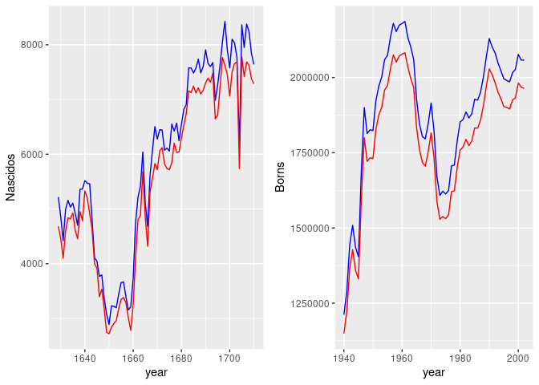
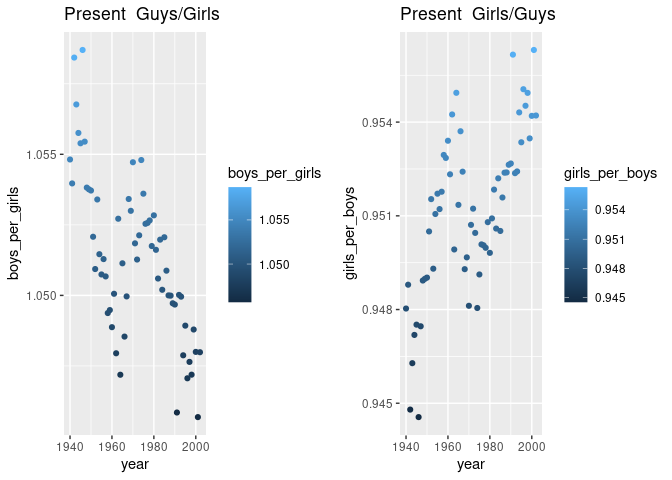

<table>
<tbody>
<tr class="odd">
<td>Disciplina</td>
<td>CD001-Estatística</td>
</tr>
<tr class="even">
<td>Professora</td>
<td>Lisiane Selau</td>
</tr>
<tr class="odd">
<td>Aluno</td>
<td>Strauss Cunha Carvalho</td>
</tr>
<tr class="even">
<td>Data</td>
<td>10/03/2022</td>
</tr>
</tbody>
</table>

    #install.packages("ggplot2")
    #install.packages("dplyr")
    #install.packages("gridExtra")
    library(ggplot2)
    library(dplyr, warn.conflicts = FALSE)
    library("gridExtra", warn.conflicts = FALSE)

##### **LAB 0** - Tarefas do Laboratório 0

####### Nas páginas anteriores, você recriou algumas das exposições e análises preliminares dos dados de batismo de Arbuthnot. Sua tarefa consiste repetir essas etapas, mas para os registros atuais de nascimento dos Estados Unidos.

###### Carregue os dados atuais com o seguinte comando.

    [openinto] ("<http://www.openintro.org/stat/data/present.R>")

###### Carregamento dos Datasets

    source("http://www.openintro.org/stat/data/present.R")
    source("http://www.openintro.org/stat/data/arbuthnot.R")

###### Pré-visualização do Dataset

    str(present)

    ## 'data.frame':    63 obs. of  3 variables:
    ##  $ year : num  1940 1941 1942 1943 1944 ...
    ##  $ boys : num  1211684 1289734 1444365 1508959 1435301 ...
    ##  $ girls: num  1148715 1223693 1364631 1427901 1359499 ...

###### Pré-visualização do Dataset

    head(present, 5)

    ##   year    boys   girls
    ## 1 1940 1211684 1148715
    ## 2 1941 1289734 1223693
    ## 3 1942 1444365 1364631
    ## 4 1943 1508959 1427901
    ## 5 1944 1435301 1359499

##### **LAB-0** - Tarefas

###### **1. Quais anos estão incluídos neste conjunto de dados? Quais são as dimensões da base de dados e quais são os nomes das colunas ou variáveis?**

###### Total de anos no dataset:

    n_distinct(present$year)

    ## [1] 63

###### Dimensões do dataset (linhas e colunas):

    dim(present)

    ## [1] 63  3

###### Variáveis independentes do dataset:

    names(present)

    ## [1] "year"  "boys"  "girls"

###### **2. Como estas contagens se comparam aos dados de Arbuthnot? Eles estão numa escala similar?**

###### Conforme gráficos a seguir, observa-se, no estudo de Arbuthnot, um aumento na quantidade de batismos e, consequentemente, nascimentos comparando os perídos de 1640 a 1700. Posteriormente, no período de 1940 a 2000, visualmente, observa-se a mesma tendência, entretanto, numa escala maior.

    plt_girls_arbuthnot = ggplot(arbuthnot) + geom_point(mapping = aes(x = year, y = girls) , color="red") + ggtitle("Arbuthnot") 
    plt_guys_arbuthnot = ggplot(arbuthnot) + geom_point(mapping = aes(x = year, y = boys), color='darkblue') + ggtitle("Arbuthnot")
    plt_girls_present = ggplot(present) + geom_point(mapping = aes(x = year, y = girls), color="red") + ggtitle("Present")
    plt_guys_present = ggplot(present) + geom_point(mapping = aes(x = year, y = boys), color="darkblue") + ggtitle("Present")
    grid.arrange(plt_girls_arbuthnot, plt_girls_present, plt_guys_arbuthnot, plt_guys_present, nrow=2, ncol=2)

###### **3. A observação de Arbuthnot de que os meninos nascem numa proporção maior que as meninas se mantém nos EUA?**

###### Sim, conforme observado visualmente, ou seja, sem rigor estatístico, nos gráficos a seguir, a taxa de nascimento de meninos é superior à taxa de meninas.

    boys_rate_arbuthnot = arbuthnot %>%
      mutate(boys_rate = arbuthnot$boys / (arbuthnot$boys + arbuthnot$girls)) %>% 
      ggplot() +
      geom_point(aes(x = year, y = boys_rate, color = boys_rate)) + ggtitle("Arbuthnot - Guys")

    girls_rate_arbuthnot = arbuthnot %>%
      mutate(girls_rate = arbuthnot$girls / (arbuthnot$boys + arbuthnot$girls)) %>% 
      ggplot() +
      geom_point(aes(x = year, y = girls_rate, color = girls_rate)) + ggtitle("Arbuthnot - Girls")

    boys_rate_present = present %>%
      mutate(boys_rate = present$boys / (present$boys + present$girls)) %>% 
      ggplot() +
      geom_point(aes(x = year, y = boys_rate, color = boys_rate)) + ggtitle("Present - Guys")

    girls_rate_present = present %>%
      mutate(girls_rate = present$girls / (present$boys + present$girls)) %>% 
      ggplot() +
      geom_point(aes(x = year, y = girls_rate, color = girls_rate)) + ggtitle("Present - Girls")

    grid.arrange(boys_rate_arbuthnot, boys_rate_present, girls_rate_arbuthnot, girls_rate_present,  nrow=2, ncol=2)

\###### **4. Crie um gráfico que mostre a razão de meninos para meninas
para cada ano do conjunto de dados. O que você pode verificar?**

###### Como se pode observar nos gráficos a seguir, a razão de meninos por meninas é superior a 1 na maior parte do dataset. O contrário, ou seja, as meninas no numerador, tem-se a razão sempre inferior a 1. Portanto, fornecendo indícios de que se nasce mais meninos do que meninas.

    boys_per_girls = present %>%
      mutate(boys_per_girls = present$boys/present$girls) %>% 
      ggplot() +
      geom_point(aes(x = year, y = boys_per_girls, color = boys_per_girls)) + ggtitle("Present  Guys/Girls")

    girls_per_boys = present %>%
      mutate(girls_per_boys = present$girls/present$boys) %>% 
      ggplot() +
      geom_point(aes(x = year, y = girls_per_boys, color = girls_per_boys)) + ggtitle("Present  Girls/Guys")

    grid.arrange(boys_per_girls, girls_per_boys, nrow=1, ncol=2)

\###### **5. Em qual ano se verifica o maior número de nascimentos nos
EUA? Você pode utilizar os arquivos de ajuda ou o cartão de referência
do R (<http://cran.r-project.org/doc/contrib/Short-refcard.pdf> ) para
encontrar comandos úteis.**

    present %>%
      mutate(borns = present$boys+present$girls) %>% 
      ggplot() +
      geom_point(aes(x = year, y = borns, color = borns)) + ggtitle("Borns")

###### No ano de 1961, houve o maior número de nascimentos nos EUA. Curiosamente, 1 ano após a invenção do comprimido anticoncepcional?

    present %>% 
        filter(boys+girls == max(boys+girls)) %>% # filter the data.frame to keep row where x is maximum
        select(year) # select column y)

    ##   year
    ## 1 1961

###### Total de nascimentos no ano de 1961:

    max(present$boys+present$girls)

    ## [1] 4268326
