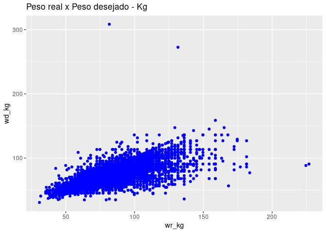
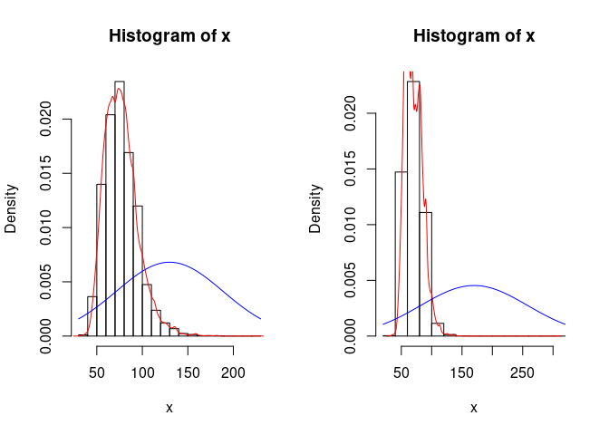

    #install.packages("ggplot2")
    #install.packages("dplyr")
    #install.packages("gridExtra")
    library(ggplot2)
    library(dplyr, warn.conflicts = FALSE)
    library("gridExtra")

    ## 
    ## Attaching package: 'gridExtra'

    ## The following object is masked from 'package:dplyr':
    ## 
    ##     combine

<table>
<tbody>
<tr class="odd">
<td>Disciplina</td>
<td>CD001-Estatística</td>
</tr>
<tr class="even">
<td>Professora</td>
<td>Lisiane Selau</td>
</tr>
<tr class="odd">
<td>Aluno</td>
<td>Strauss Cunha Carvalho</td>
</tr>
<tr class="even">
<td>Data</td>
<td>11/03/2022</td>
</tr>
</tbody>
</table>

    source("http://www.openintro.org/stat/data/cdc.R")
    str(cdc)

    ## 'data.frame':    20000 obs. of  9 variables:
    ##  $ genhlth : Factor w/ 5 levels "excellent","very good",..: 3 3 3 3 2 2 2 2 3 3 ...
    ##  $ exerany : num  0 0 1 1 0 1 1 0 0 1 ...
    ##  $ hlthplan: num  1 1 1 1 1 1 1 1 1 1 ...
    ##  $ smoke100: num  0 1 1 0 0 0 0 0 1 0 ...
    ##  $ height  : num  70 64 60 66 61 64 71 67 65 70 ...
    ##  $ weight  : int  175 125 105 132 150 114 194 170 150 180 ...
    ##  $ wtdesire: int  175 115 105 124 130 114 185 160 130 170 ...
    ##  $ age     : int  77 33 49 42 55 55 31 45 27 44 ...
    ##  $ gender  : Factor w/ 2 levels "m","f": 1 2 2 2 2 2 1 1 2 1 ...

#### **Laboratório 1 - LAB-1**

##### 1. Crie um gráfico de dispersão da variável peso em relação ao peso desejado. Defina a relação entre essas duas variáveis.

    cdc$wr_kg = 0.453592 * cdc$weight
    cdc$wd_kg = 0.453592 * cdc$wtdesire

    ggplot(cdc) + geom_point(mapping = aes(x = wr_kg, y = wd_kg) , color="blue") + ggtitle("Peso real x Peso desejado - Kg") 

Correlação de Pearson indica uma forte relação entre peso real e peso
desejado.

    cor(cdc$wr_kg,cdc$wd_kg)

    ## [1] 0.8000521

Teste de suposição de normalidade

    histogram=function(x){
      hist(x,prob=T)
      lines(density(x),col="red")
      curve(dnorm(x,mean(x), sd(x)),add=T,col="blue")
    }
    par(mfrow=c(1,2))
    w_real = histogram(cdc$wr_kg)
    w_desired = histogram(cdc$wd_kg)

1.  Vamos considerar uma nova variável: a diferença entre o peso
    desejado (wtdesire) e o peso atual (weight). Crie esta nova variável
    subtraindo as duas colunas na base de dados e atribuindo-as a um
    novo objeto chamado wdiff.

2.  Que tipo de dado está contido na variável wdiff? Se uma observação
    de wdiff é 0, o que isso implica com relação ao peso atual e
    desejado de uma pessoas? E se o valor de wdiff for positivo ou
    negativo?

3.  Descreva a distribuição de wdiff em termos de seu centro, forma e
    variação, incluindo qualquer gráfico que você usar. O que isso nos
    diz sobre como as pessoas se sentem a respeito do seu peso atual?

4.  Utilizando sumários numéricos e um gráfico de caixas lado-a-lado,
    determine se homens tendem a ver seu peso diferentemente das
    mulheres.

5.  Agora chegou a hora de usar a criatividade. Encontre a média e o
    desvio padrão de weight e determine qual a proporção de pesos que
    estão a um desvio padrão da média.
