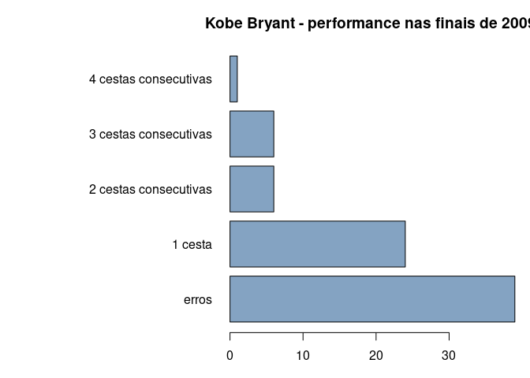
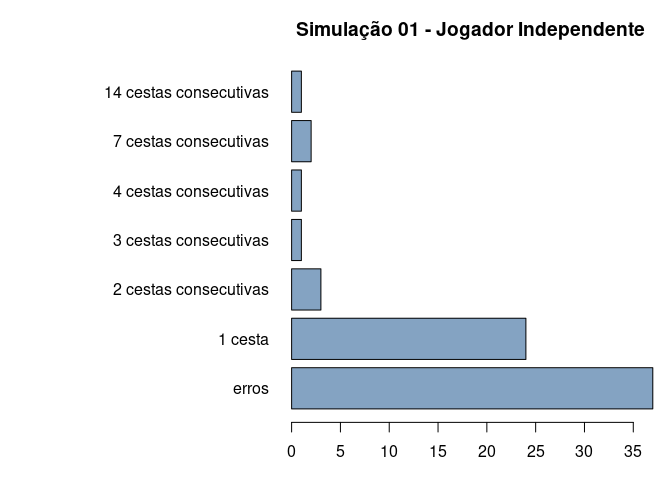
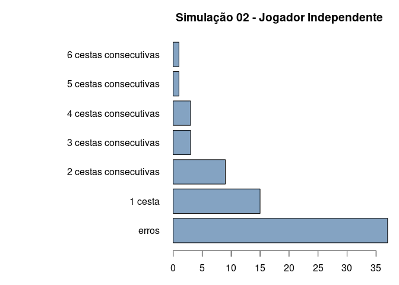

<table>
<tbody>
<tr class="odd">
<td><strong>Disciplina</strong></td>
<td>:CD001-Estatística</td>
</tr>
<tr class="even">
<td><strong>Professora</strong></td>
<td>:Lisiane Selau</td>
</tr>
<tr class="odd">
<td><strong>Aluno</strong></td>
<td>:Strauss Cunha Carvalho</td>
</tr>
<tr class="even">
<td><strong>Labarotório</strong></td>
<td>:LAB-02</td>
</tr>
<tr class="odd">
<td><strong>Data</strong></td>
<td>:14/03/2022</td>
</tr>
</tbody>
</table>

##### **Github do Laboratório 02 - Markdown**

-   \[Github\]
    (<https://github.com/stra-uss/ufrgs-posgrad/blob/main/cd001-statistics/ufrgs-estatistica-strauss-lab02.md>)

##### **Laboratório 2 - LAB-02**

-   Carregamento (ou instalação de R Packages necessários)

<!-- -->

    #install.packages("ggplot2")
    #install.packages("dplyr")
    #install.packages("gridExtra")
    library(ggplot2)
    library(dplyr, warn.conflicts = FALSE)
    library("gridExtra", warn.conflicts = FALSE)

-   Carregamento dos Datasets

<!-- -->

    download.file("http://www.openintro.org/stat/data/kobe.RData", destfile = "kobe.RData")
    load("kobe.RData")

-   Pré-visualização dos tipos de variáveis dataset

<!-- -->

    str(kobe)

    ## 'data.frame':    133 obs. of  6 variables:
    ##  $ vs         : Factor w/ 1 level "ORL": 1 1 1 1 1 1 1 1 1 1 ...
    ##  $ game       : int  1 1 1 1 1 1 1 1 1 1 ...
    ##  $ quarter    : Factor w/ 5 levels "1","1OT","2",..: 1 1 1 1 1 1 1 1 1 3 ...
    ##  $ time       : Factor w/ 116 levels "00:00.0","00:00.5",..: 114 109 102 100 96 85 64 21 11 91 ...
    ##  $ description: Factor w/ 80 levels "Bryant 3pt Shot: Made (16 PTS) Assist: Bynum (1 AST)  ",..: 40 78 75 27 44 78 52 62 79 45 ...
    ##  $ basket     : chr  "H" "M" "M" "H" ...

-   Pré-visualização de uma pequena amostra do dataset

<!-- -->

    head(kobe, 5)

    ##    vs game quarter time                                             description
    ## 1 ORL    1       1 9:47                 Kobe Bryant makes 4-foot two point shot
    ## 2 ORL    1       1 9:07                               Kobe Bryant misses jumper
    ## 3 ORL    1       1 8:11                        Kobe Bryant misses 7-foot jumper
    ## 4 ORL    1       1 7:41 Kobe Bryant makes 16-foot jumper (Derek Fisher assists)
    ## 5 ORL    1       1 7:03                         Kobe Bryant makes driving layup
    ##   basket
    ## 1      H
    ## 2      M
    ## 3      M
    ## 4      H
    ## 5      H

#### **Tarefas**

##### **Utilizando a função calc\_streak, calcule o comprimento das sequências do vetor sim\_basket.**

    kobe_basket <- calc_streak(kobe$basket)
    kobe_basket

    ##  [1] 1 0 2 0 0 0 3 2 0 3 0 1 3 0 0 0 0 0 1 1 0 4 1 0 1 0 1 0 1 2 0 1 2 1 0 0 1 0
    ## [39] 0 0 1 1 0 1 0 2 0 0 0 3 0 1 0 1 2 1 0 1 0 0 1 3 3 1 1 0 0 0 0 0 1 1 0 0 0 1

##### **1. Descreva a distribuição das sequências de arremessos. Qual é o comprimento de sequência típico para o arremessador independente simulado com um percentual de arremesso de 45%? Quão longa é a sequência mais longa de cestas em 133 arremessos?**

-   1.1 - A distribuição de frequência das sequências de arremesos de
    Kobe Bryant nas finais de 2009, conforme apresentado no gráfico a
    seguir, contradiz a hipótese das “mãos quentes”. Ou seja, de um modo
    geral, quanto maior a quantidade de acertos consecutivos, menor é o
    número de sequencias.

<!-- -->

    par(mar=c(3, 15, 3, 1))
    barplot(table(kobe_basket), main="Kobe Bryant - performance nas finais de 2009", las=1, horiz=TRUE,
            names.arg=c("erros",
                        "1 cesta",
                        "2 cestas consecutivas",
                        "3 cestas consecutivas",
                        "4 cestas consecutivas"),
            col=rgb(0.2,0.4,0.6,0.6,0.7))

-   1.2 - Para comparar Kobe Bryant com um jogador independente
    aleatório, a seguir, gerou-se 133 arremessos. Neles, assim como o
    ex-jogador da NBA, considerando uma probabilidade de acertos em 45%
    e de erros em 55%.

<!-- -->

    # Semenente para replicar os mesmos resultados a cada execução posterior
    set.seed(12)

    tp_arremessos <- c("M", "H")
    arremessos_jogador_indep =  sample(tp_arremessos, size = 133, replace = TRUE, prob = c(0.55, 0.45))
    arremessos_jogador_indep

    ##   [1] "M" "H" "H" "M" "M" "M" "M" "H" "M" "M" "M" "H" "M" "M" "M" "M" "M" "M"
    ##  [19] "H" "M" "M" "H" "M" "H" "M" "M" "M" "M" "M" "H" "M" "H" "H" "H" "H" "H"
    ##  [37] "H" "H" "M" "M" "H" "M" "H" "M" "H" "M" "M" "M" "M" "H" "M" "M" "M" "M"
    ##  [55] "H" "H" "H" "H" "H" "H" "H" "M" "H" "H" "M" "M" "M" "H" "M" "H" "M" "H"
    ##  [73] "H" "M" "M" "H" "H" "H" "M" "H" "M" "H" "M" "M" "H" "M" "M" "H" "M" "M"
    ##  [91] "H" "M" "M" "M" "H" "M" "H" "M" "M" "M" "M" "H" "M" "H" "H" "H" "H" "M"
    ## [109] "M" "M" "H" "M" "H" "M" "M" "H" "M" "H" "H" "H" "H" "H" "H" "H" "H" "H"
    ## [127] "H" "H" "H" "H" "H" "M" "H"

-   1.3 - Calculando o comprimento das sequências do jogador
    independente aleatório:

<!-- -->

    jogador_indep_basket <- calc_streak(arremessos_jogador_indep)
    jogador_indep_basket

    ##  [1]  0  2  0  0  0  1  0  0  1  0  0  0  0  0  1  0  1  1  0  0  0  0  1  7  0
    ## [26]  1  1  1  0  0  0  1  0  0  0  7  2  0  0  1  1  2  0  3  1  1  0  1  0  1
    ## [51]  0  1  0  0  1  1  0  0  0  1  4  0  0  1  1  0  1 14  1

-   1.4 - A distribuição de frequência das sequências de arremesos do
    jogador independente (simulado), conforme apresentado no gráfico a
    seguir, houve sequências com maiores comprimentos se comparado com
    as de Kobe Bryant. Portando, houve sequências de comprimento 7 e 14,
    ou seja, acertos consecutivos - “mãos mais quentes” que as de Kobe
    Bryant.

<!-- -->

    par(mar=c(3, 15, 3, 1))
    barplot(table(jogador_indep_basket), main="Simulação 01 - Jogador Independente", las=1, horiz=TRUE,
            names.arg=c("erros",
                        "1 cesta",
                        "2 cestas consecutivas",
                        "3 cestas consecutivas",
                        "4 cestas consecutivas",
                        "7 cestas consecutivas",
                        "14 cestas consecutivas"),
            col=rgb(0.2,0.4,0.6,0.6,0.7))

-   1.5 O maior comprimento das sequências do jogador independente foi
    14, conforme gráfico acima.

##### **2. Se você rodasse a simulação do arremessador independente uma segunda vez, como você acha que seria a distribuição de sequências em relação à distribuição da questão acima? Exatamente a mesma?**

##### **Mais ou menos parecida? Completamente diferente? Explique seu raciocínio.**

-   2.1 Simulação de novos arremessos para o jogador independente e
    cálculo do comprimento das respectivas sequencias.

<!-- -->

    # Semenente para replicar os mesmos resultados a cada execução posterior
    set.seed(16)
    arremessos_jogador_indep_s2 =  sample(tp_arremessos, size = 133, replace = TRUE, prob = c(0.55, 0.45))

    jogador_indep_basket_s2 <- calc_streak(arremessos_jogador_indep_s2)

-   2.2 A distribuição de frequência das sequências de arremesos da
    segunda simulação do jogador. Observa-se, no gráfico a seguir, uma
    distribuição de frequência diferente da anterior, na simulação 1.
    Ambas simulações possui as mesmas frequências menores, de 0 a
    quatro, porém com valores diferentes. Já as frequencias maiores há
    uma divergência no número e nos valores; sete e quatorze para a
    primeira simulação e cinco e seis para a segunda simulação.

<!-- -->

    par(mar=c(3, 15, 3, 1))
    barplot(table(jogador_indep_basket_s2), main="Simulação 02 - Jogador Independente", las=1, horiz=TRUE,
            names.arg=c("erros",
                        "1 cesta",
                        "2 cestas consecutivas",
                        "3 cestas consecutivas",
                        "4 cestas consecutivas",
                        "5 cestas consecutivas",
                        "6 cestas consecutivas"),
            col=rgb(0.2,0.4,0.6,0.6,0.7))

##### **3. Como a distribuição dos comprimentos de sequência de Kobe Bryant, analisada na página 2, se comparam à distribuição de comprimentos de sequência do arremessador simulado? Utilizando essa comparação, você tem evidência de que o modelo das mãos quentes se ajusta aos padrões de arremessos de Kobe? Explique.**

-   Por meio das duas simulações realizadas, observou-se que, para o
    mesmo número de arremessos (133) com mesma probabilidade de acertos
    (45%), ambas resultaram em sequencias de comprimentos maiores, ou
    seja, mais acertos consecutivos.
-   Assim, as “maõs quentes” do jogador independente nas duas simulações
    foram mais quentes que as de Kobe Bryant.
-   Por curiosidade, segundo o Paper de Gilovich, et. al (1985) \[1\],
    os torcedores de Basquete têm a incapacidade de detectar correlações
    sequenciais em sequencias negativas (erros). Contraditoriamente, por
    algum viés cognitivo, o mesmo não ocorre em senquências positivas
    (acertos) gerando um crença errônea.

##### **4. Quais conceitos do livro são abordados neste laboratório? Quais conceitos, se houver algum, que não são abordados no livro? Você viu esses conceito em algum outro lugar, p.e., aulas, seções de discussão, laboratórios anteriores, ou tarefas de casa? Seja específico em sua resposta.**\*

-   Foram abordados os conceitos introdutórios de Probabilidade e
    Distribuição de Variáveis Aleatórias.
-   O livro contém uma estrutua didática na qual evolui, passo a passo,
    para o entendimento dos úteis e necessários conceitos e técnicas
    estatísticas para não estatísticos.
-   Na área de exatas, no que se refere à engenharia, a estatística
    sempre está presente. No âmbito da análise de dados, seu uso é
    essencial. Sem estatística, não há ciência.
-   Apesar de toda sua importância, no entanto, o que se observa, quanto
    à aplicabilidade por não estatísticos ou não matemáticos ou não
    cientistas, é um certo negligenciamento ou imcompreensão. Ah, como
    seria ótimo se a humanidade submetesse suas loucas hipóteses a
    testes estatísticos.

##### **Referências**

-   \[1\]
    (<https://home.cs.colorado.edu/~mozer/Teaching/syllabi/7782/readings/gilovich%20vallone%20tversky.pdf>)
