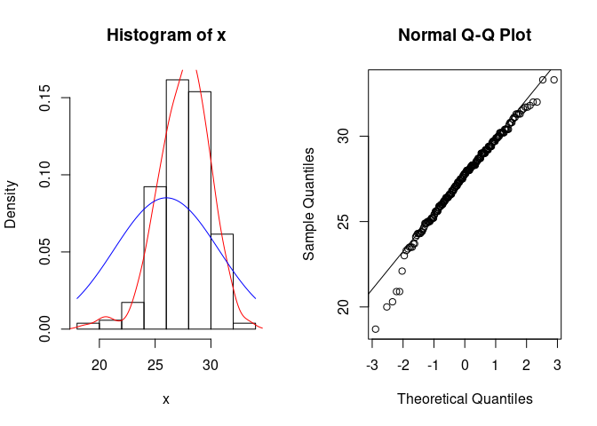
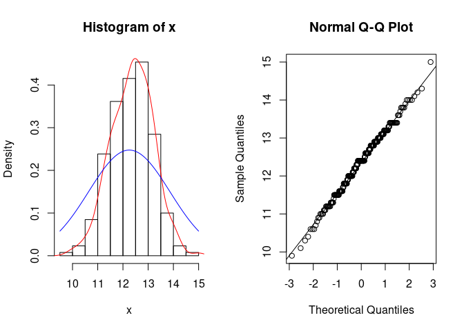
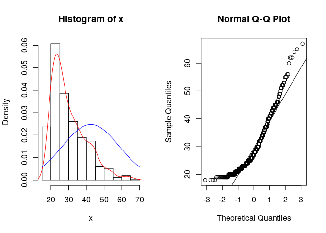
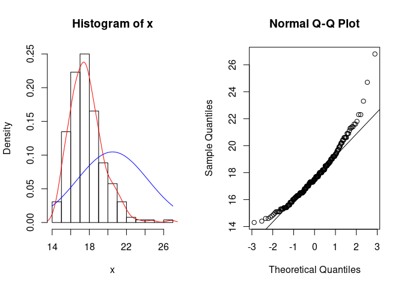
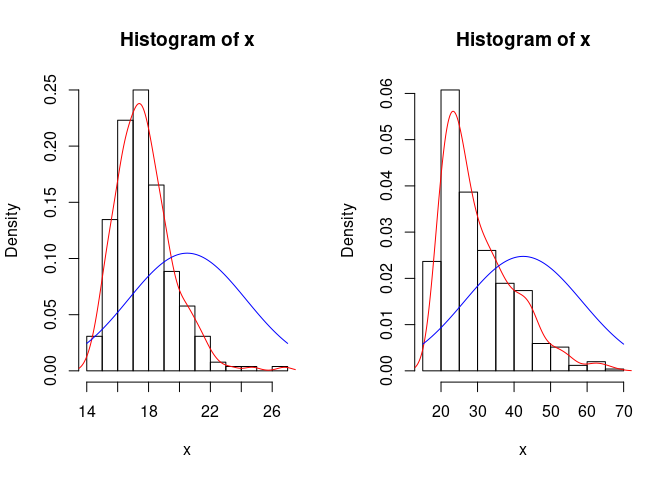
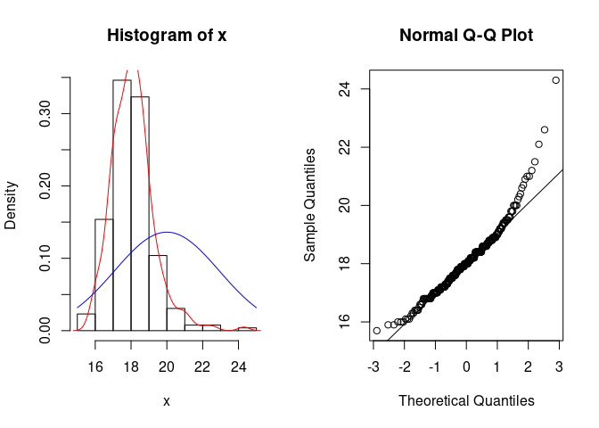

<table>
<tbody>
<tr class="odd">
<td><strong>Disciplina</strong></td>
<td>:CD001-Estatística</td>
</tr>
<tr class="even">
<td><strong>Professora</strong></td>
<td>:Lisiane Selau</td>
</tr>
<tr class="odd">
<td><strong>Aluno</strong></td>
<td>:Strauss Cunha Carvalho</td>
</tr>
<tr class="even">
<td><strong>Labarotório</strong></td>
<td>:LAB-03</td>
</tr>
<tr class="odd">
<td><strong>Data</strong></td>
<td>:18/03/2022</td>
</tr>
</tbody>
</table>

##### **Github do Laboratório 03 - Markdown**

-   \[Github\]
    (<https://github.com/stra-uss/ufrgs-posgrad/blob/main/cd001-statistics/ufrgs-estatistica-strauss-lab03.md>)

##### **Laboratório 3 - LAB-03**

-   Carregamento (ou instalação de R Packages necessários)

<!-- -->

    #install.packages("ggplot2")
    #install.packages("dplyr")
    #install.packages("gridExtra")
    library(ggplot2)
    library(dplyr, warn.conflicts = FALSE)
    library("gridExtra", warn.conflicts = FALSE)

-   Carregamento dos Datasets

<!-- -->

    download.file("http://www.openintro.org/stat/data/bdims.RData", destfile = "bdims.RData")
    load("bdims.RData")

-   Pré-visualização dos tipos de variáveis dataset

<!-- -->

    str(bdims)

    ## 'data.frame':    507 obs. of  25 variables:
    ##  $ bia.di: num  42.9 43.7 40.1 44.3 42.5 43.3 43.5 44.4 43.5 42 ...
    ##  $ bii.di: num  26 28.5 28.2 29.9 29.9 27 30 29.8 26.5 28 ...
    ##  $ bit.di: num  31.5 33.5 33.3 34 34 31.5 34 33.2 32.1 34 ...
    ##  $ che.de: num  17.7 16.9 20.9 18.4 21.5 19.6 21.9 21.8 15.5 22.5 ...
    ##  $ che.di: num  28 30.8 31.7 28.2 29.4 31.3 31.7 28.8 27.5 28 ...
    ##  $ elb.di: num  13.1 14 13.9 13.9 15.2 14 16.1 15.1 14.1 15.6 ...
    ##  $ wri.di: num  10.4 11.8 10.9 11.2 11.6 11.5 12.5 11.9 11.2 12 ...
    ##  $ kne.di: num  18.8 20.6 19.7 20.9 20.7 18.8 20.8 21 18.9 21.1 ...
    ##  $ ank.di: num  14.1 15.1 14.1 15 14.9 13.9 15.6 14.6 13.2 15 ...
    ##  $ sho.gi: num  106 110 115 104 108 ...
    ##  $ che.gi: num  89.5 97 97.5 97 97.5 ...
    ##  $ wai.gi: num  71.5 79 83.2 77.8 80 82.5 82 76.8 68.5 77.5 ...
    ##  $ nav.gi: num  74.5 86.5 82.9 78.8 82.5 80.1 84 80.5 69 81.5 ...
    ##  $ hip.gi: num  93.5 94.8 95 94 98.5 95.3 101 98 89.5 99.8 ...
    ##  $ thi.gi: num  51.5 51.5 57.3 53 55.4 57.5 60.9 56 50 59.8 ...
    ##  $ bic.gi: num  32.5 34.4 33.4 31 32 33 42.4 34.1 33 36.5 ...
    ##  $ for.gi: num  26 28 28.8 26.2 28.4 28 32.3 28 26 29.2 ...
    ##  $ kne.gi: num  34.5 36.5 37 37 37.7 36.6 40.1 39.2 35.5 38.3 ...
    ##  $ cal.gi: num  36.5 37.5 37.3 34.8 38.6 36.1 40.3 36.7 35 38.6 ...
    ##  $ ank.gi: num  23.5 24.5 21.9 23 24.4 23.5 23.6 22.5 22 22.2 ...
    ##  $ wri.gi: num  16.5 17 16.9 16.6 18 16.9 18.8 18 16.5 16.9 ...
    ##  $ age   : int  21 23 28 23 22 21 26 27 23 21 ...
    ##  $ wgt   : num  65.6 71.8 80.7 72.6 78.8 74.8 86.4 78.4 62 81.6 ...
    ##  $ hgt   : num  174 175 194 186 187 ...
    ##  $ sex   : Factor w/ 2 levels "0","1": 2 2 2 2 2 2 2 2 2 2 ...

-   Pré-visualização de uma pequena amostra do dataset

<!-- -->

    head(bdims, 5)

    ##   bia.di bii.di bit.di che.de che.di elb.di wri.di kne.di ank.di sho.gi che.gi
    ## 1   42.9   26.0   31.5   17.7   28.0   13.1   10.4   18.8   14.1  106.2   89.5
    ## 2   43.7   28.5   33.5   16.9   30.8   14.0   11.8   20.6   15.1  110.5   97.0
    ## 3   40.1   28.2   33.3   20.9   31.7   13.9   10.9   19.7   14.1  115.1   97.5
    ## 4   44.3   29.9   34.0   18.4   28.2   13.9   11.2   20.9   15.0  104.5   97.0
    ## 5   42.5   29.9   34.0   21.5   29.4   15.2   11.6   20.7   14.9  107.5   97.5
    ##   wai.gi nav.gi hip.gi thi.gi bic.gi for.gi kne.gi cal.gi ank.gi wri.gi age
    ## 1   71.5   74.5   93.5   51.5   32.5   26.0   34.5   36.5   23.5   16.5  21
    ## 2   79.0   86.5   94.8   51.5   34.4   28.0   36.5   37.5   24.5   17.0  23
    ## 3   83.2   82.9   95.0   57.3   33.4   28.8   37.0   37.3   21.9   16.9  28
    ## 4   77.8   78.8   94.0   53.0   31.0   26.2   37.0   34.8   23.0   16.6  23
    ## 5   80.0   82.5   98.5   55.4   32.0   28.4   37.7   38.6   24.4   18.0  22
    ##    wgt   hgt sex
    ## 1 65.6 174.0   1
    ## 2 71.8 175.3   1
    ## 3 80.7 193.5   1
    ## 4 72.6 186.5   1
    ## 5 78.8 187.2   1

#### **Tarefas**

##### **1. Agora vamos analisar outras variáveis no conjunto de dados das dimensões corporais. Utilizando as figuras na próxima página, combine os histogramas com seus gráficos de probabilidade normal.**

##### **Todas as variáveis foram estandardizadas (primeiro subtraindo a média, e em seguida dividindo pelo desvio padrão), de tal forma que as unidades não serão de qualquer ajuda. Se você estiver incerto com base nessas figuras, gere um gráfico no R para verificar.**

##### a) O histograma do diâmetro bi-ilíaco (pélvico) feminino (bii.di) pertence ao gráfico de probabilidade normal de letra …

-   O subconjunto de mulheres:

<!-- -->

    female_ims <- subset(bdims, bdims$sex == 0)

-   *μ*

<!-- -->

    mu <-mean(female_ims$bii.di)
    mu

    ## [1] 27.58154

-   *σ*

<!-- -->

    ss <- sd(female_ims$bii.di)
    ss

    ## [1] 2.307476

-   *z*

$$z = \\frac{x - 27,58}{2,307} $$

-   Histograma e Distribuição de Probabilidade

<!-- -->

    histogram=function(x){
      hist(x,prob=T)
      lines(density(x),col="red")
      curve(dnorm(x,mean(x), sd(x)),add=T,col="blue")
    }

    par(mfrow=c(1,2))
    hist = histogram(female_ims$bii.di)

    qqnorm(female_ims$bii.di)
    grafico_prob = qqline(female_ims$bii.di) 

##### b) O histograma do diâmetro do cotovelo feminino (elb.di) pertence ao gráfico de probabilidade normal de letra …

-   *μ*

<!-- -->

    mu <-mean(female_ims$elb.di)
    mu

    ## [1] 12.36692

-   *σ*

<!-- -->

    ss <- sd(female_ims$elb.di)
    ss

    ## [1] 0.8363728

-   *z*
    $$z = \\frac{x - 12,36}{0,863} $$

-   Histograma e Distribuição de Probabilidade

<!-- -->

    par(mfrow=c(1,2))
    hist = histogram(female_ims$elb.di)

    qqnorm(female_ims$elb.di)
    grafico_prob = qqline(female_ims$elb.di) 

##### c) O histograma de idade geral (age) pertence ao gráfico de probabilidade normal de letra …

-   *μ*

<!-- -->

    mu <-mean(bdims$age)
    mu

    ## [1] 30.18146

-   *σ*

<!-- -->

    ss <- sd(bdims$age)
    ss

    ## [1] 9.608472

-   *z*
    $$z = \\frac{x - 30,18}{9,60} $$

-   Histograma e Distribuição de Probabilidade

<!-- -->

    par(mfrow=c(1,2))
    hist = histogram(bdims$age)

    qqnorm(bdims$age)
    grafico_prob = qqline(bdims$age)

##### d) O histograma de profundidade do peito feminino (che.de) pertence ao gráfico de probabilidade normal de letra …

-   *μ*

<!-- -->

    mu <-mean(female_ims$che.de)
    mu

    ## [1] 17.72462

-   *σ*

<!-- -->

    ss <- sd(female_ims$che.de)
    ss

    ## [1] 1.832064

-   *z*
    $$z = \\frac{x - 17,72}{1,832} $$

-   Histograma e Distribuição de Probabilidade

<!-- -->

    par(mfrow=c(1,2))
    hist = histogram(female_ims$che.de)

    qqnorm(female_ims$che.de)
    grafico_prob = qqline(female_ims$che.de)

##### **2. Perceba que os gráficos de probabilidade normal C e D tem um pequeno padrão passo a passo. Por que você acha que eles são assim?**

-   Visualmente, nos respectivos gráficos a seguir, respectivamente
    oriundos de C e D, observa-se que a distribuição de probabilidade
    (curva vermelha) se difere significamente da curva azul, na qual
    representa a distribuição normal padrão.

<!-- -->

    par(mfrow=c(1,2))
    hist = histogram(female_ims$che.de)
    hist = histogram(bdims$age)

##### **3. Como você pode ver, gráficos de probabilidade normal podem ser utilizados tanto para avaliar a normalidade quanto visualizar a assimetria. Crie um gráfico de probabilidade normal para o diâmetro do joelho feminino (kne.di). Baseado neste gráfico de probabilidade normal, você diria que essa variável é simétrica, assimétrica à direita ou assimétrica à esquerda? Utiliza um histograma para confirmar seu resultado.**

-   Como se observa no gráfico a seguir, a distribuição da variável
    knee.di é assimétrica à direita, indicando assimetria positiva.

<!-- -->

    par(mfrow=c(1,2))
    hist = histogram(female_ims$kne.di)

    qqnorm(female_ims$kne.di)
    grafico_prob = qqline(female_ims$kne.di)

##### **4. Quais conceitos do livro são abordados neste laboratório? Quais conceitos, se houver algum, que não são abordados no livro? Você viu esses conceito em algum outro lugar, p.e., aulas, seções de discussão, laboratórios anteriores, ou tarefas de casa? Seja específico em sua resposta.**

-   Lei dos grande números

-   Distribuições de probabilidade

-   Conceitos amplamente vistos em artigos científicos
