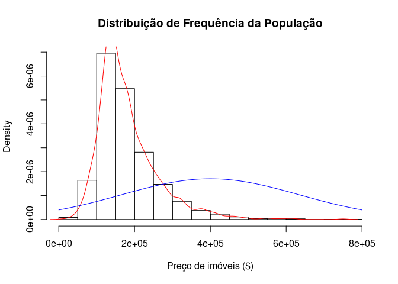
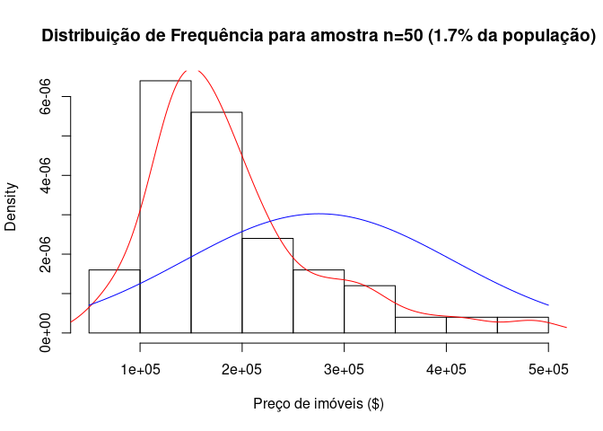
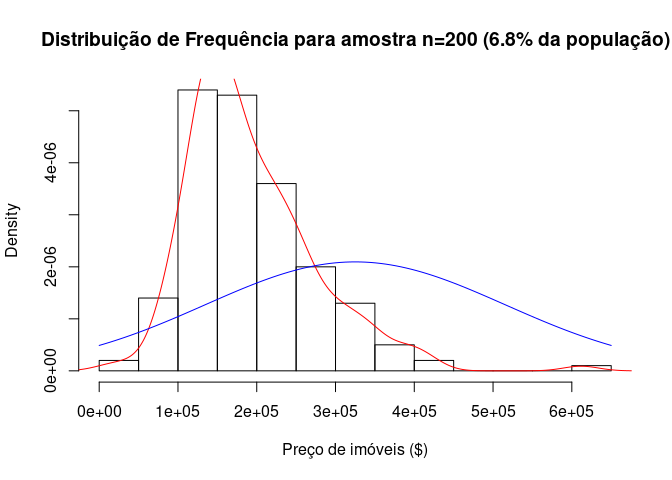
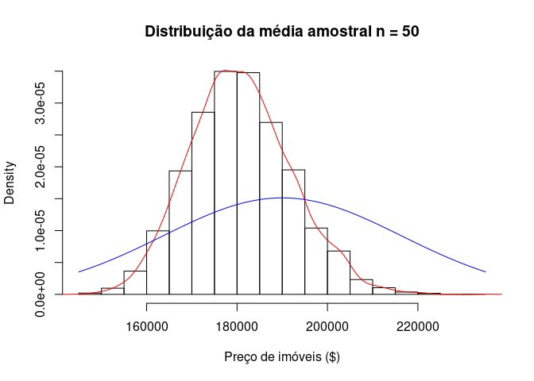
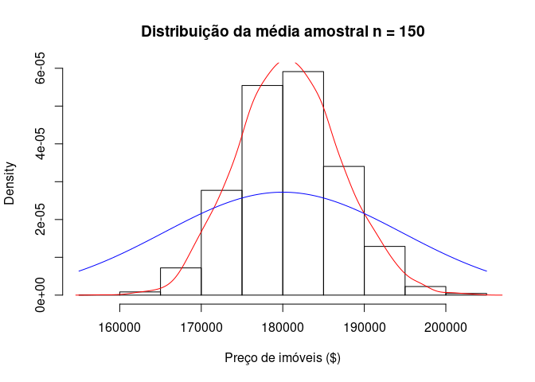
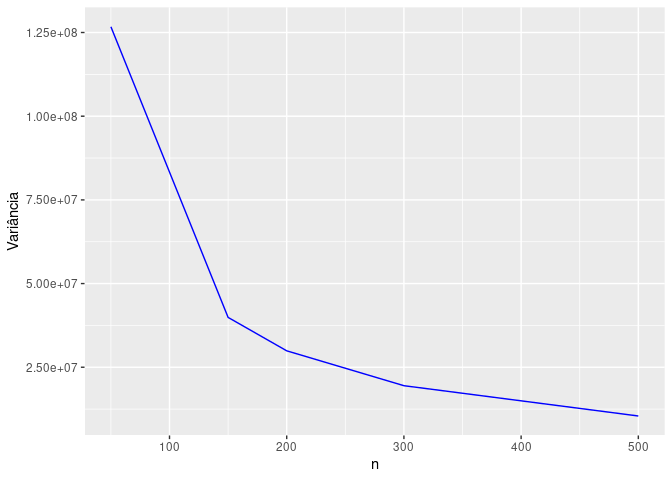
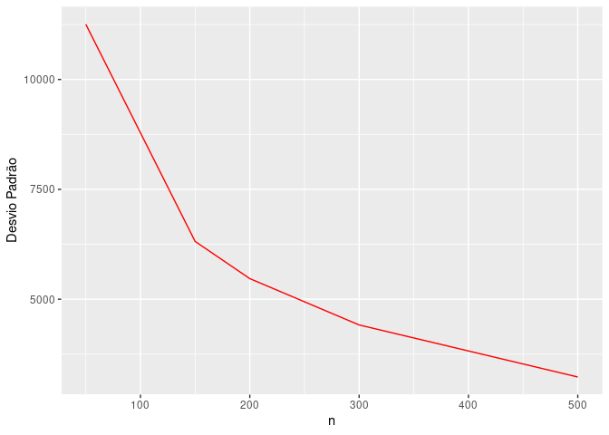

<table>
<tbody>
<tr class="odd">
<td><strong>Disciplina</strong></td>
<td>:CD001-Estatística</td>
</tr>
<tr class="even">
<td><strong>Professora</strong></td>
<td>:Lisiane Selau</td>
</tr>
<tr class="odd">
<td><strong>Aluno</strong></td>
<td>:Strauss Cunha Carvalho</td>
</tr>
<tr class="even">
<td><strong>Labarotório</strong></td>
<td>:LAB-04</td>
</tr>
<tr class="odd">
<td><strong>Data</strong></td>
<td>:16/03/2022</td>
</tr>
</tbody>
</table>

##### **Github do Laboratório 04A - Markdown**

-   \[Github\]
    (<https://github.com/stra-uss/ufrgs-posgrad/blob/main/cd001-statistics/ufrgs-estatistica-strauss-lab04a.md>)

##### **Laboratório 4A - LAB-04A**

-   Carregamento (ou instalação de R Packages necessários)

<!-- -->

    #install.packages("ggplot2")
    #install.packages("dplyr")
    #install.packages("gridExtra")
    library(ggplot2)
    library(dplyr, warn.conflicts = FALSE)
    library("gridExtra", warn.conflicts = FALSE)

-   Carregamento dos Datasets

<!-- -->

    download.file("http://www.openintro.org/stat/data/ames.RData", destfile = "ames.RData")
    load("ames.RData")

-   Pré-visualização dos tipos de variáveis dataset

<!-- -->

    str(ames)

    ## 'data.frame':    2930 obs. of  82 variables:
    ##  $ Order          : int  1 2 3 4 5 6 7 8 9 10 ...
    ##  $ PID            : int  526301100 526350040 526351010 526353030 527105010 527105030 527127150 527145080 527146030 527162130 ...
    ##  $ MS.SubClass    : int  20 20 20 20 60 60 120 120 120 60 ...
    ##  $ MS.Zoning      : Factor w/ 7 levels "A (agr)","C (all)",..: 6 5 6 6 6 6 6 6 6 6 ...
    ##  $ Lot.Frontage   : int  141 80 81 93 74 78 41 43 39 60 ...
    ##  $ Lot.Area       : int  31770 11622 14267 11160 13830 9978 4920 5005 5389 7500 ...
    ##  $ Street         : Factor w/ 2 levels "Grvl","Pave": 2 2 2 2 2 2 2 2 2 2 ...
    ##  $ Alley          : Factor w/ 2 levels "Grvl","Pave": NA NA NA NA NA NA NA NA NA NA ...
    ##  $ Lot.Shape      : Factor w/ 4 levels "IR1","IR2","IR3",..: 1 4 1 4 1 1 4 1 1 4 ...
    ##  $ Land.Contour   : Factor w/ 4 levels "Bnk","HLS","Low",..: 4 4 4 4 4 4 4 2 4 4 ...
    ##  $ Utilities      : Factor w/ 3 levels "AllPub","NoSeWa",..: 1 1 1 1 1 1 1 1 1 1 ...
    ##  $ Lot.Config     : Factor w/ 5 levels "Corner","CulDSac",..: 1 5 1 1 5 5 5 5 5 5 ...
    ##  $ Land.Slope     : Factor w/ 3 levels "Gtl","Mod","Sev": 1 1 1 1 1 1 1 1 1 1 ...
    ##  $ Neighborhood   : Factor w/ 28 levels "Blmngtn","Blueste",..: 16 16 16 16 9 9 25 25 25 9 ...
    ##  $ Condition.1    : Factor w/ 9 levels "Artery","Feedr",..: 3 2 3 3 3 3 3 3 3 3 ...
    ##  $ Condition.2    : Factor w/ 8 levels "Artery","Feedr",..: 3 3 3 3 3 3 3 3 3 3 ...
    ##  $ Bldg.Type      : Factor w/ 5 levels "1Fam","2fmCon",..: 1 1 1 1 1 1 5 5 5 1 ...
    ##  $ House.Style    : Factor w/ 8 levels "1.5Fin","1.5Unf",..: 3 3 3 3 6 6 3 3 3 6 ...
    ##  $ Overall.Qual   : int  6 5 6 7 5 6 8 8 8 7 ...
    ##  $ Overall.Cond   : int  5 6 6 5 5 6 5 5 5 5 ...
    ##  $ Year.Built     : int  1960 1961 1958 1968 1997 1998 2001 1992 1995 1999 ...
    ##  $ Year.Remod.Add : int  1960 1961 1958 1968 1998 1998 2001 1992 1996 1999 ...
    ##  $ Roof.Style     : Factor w/ 6 levels "Flat","Gable",..: 4 2 4 4 2 2 2 2 2 2 ...
    ##  $ Roof.Matl      : Factor w/ 8 levels "ClyTile","CompShg",..: 2 2 2 2 2 2 2 2 2 2 ...
    ##  $ Exterior.1st   : Factor w/ 16 levels "AsbShng","AsphShn",..: 4 14 15 4 14 14 6 7 6 14 ...
    ##  $ Exterior.2nd   : Factor w/ 17 levels "AsbShng","AsphShn",..: 11 15 16 4 15 15 6 7 6 15 ...
    ##  $ Mas.Vnr.Type   : Factor w/ 6 levels "","BrkCmn","BrkFace",..: 6 5 3 5 5 3 5 5 5 5 ...
    ##  $ Mas.Vnr.Area   : int  112 0 108 0 0 20 0 0 0 0 ...
    ##  $ Exter.Qual     : Factor w/ 4 levels "Ex","Fa","Gd",..: 4 4 4 3 4 4 3 3 3 4 ...
    ##  $ Exter.Cond     : Factor w/ 5 levels "Ex","Fa","Gd",..: 5 5 5 5 5 5 5 5 5 5 ...
    ##  $ Foundation     : Factor w/ 6 levels "BrkTil","CBlock",..: 2 2 2 2 3 3 3 3 3 3 ...
    ##  $ Bsmt.Qual      : Factor w/ 6 levels "","Ex","Fa","Gd",..: 6 6 6 6 4 6 4 4 4 6 ...
    ##  $ Bsmt.Cond      : Factor w/ 6 levels "","Ex","Fa","Gd",..: 4 6 6 6 6 6 6 6 6 6 ...
    ##  $ Bsmt.Exposure  : Factor w/ 5 levels "","Av","Gd","Mn",..: 3 5 5 5 5 5 4 5 5 5 ...
    ##  $ BsmtFin.Type.1 : Factor w/ 7 levels "","ALQ","BLQ",..: 3 6 2 2 4 4 4 2 4 7 ...
    ##  $ BsmtFin.SF.1   : int  639 468 923 1065 791 602 616 263 1180 0 ...
    ##  $ BsmtFin.Type.2 : Factor w/ 7 levels "","ALQ","BLQ",..: 7 5 7 7 7 7 7 7 7 7 ...
    ##  $ BsmtFin.SF.2   : int  0 144 0 0 0 0 0 0 0 0 ...
    ##  $ Bsmt.Unf.SF    : int  441 270 406 1045 137 324 722 1017 415 994 ...
    ##  $ Total.Bsmt.SF  : int  1080 882 1329 2110 928 926 1338 1280 1595 994 ...
    ##  $ Heating        : Factor w/ 6 levels "Floor","GasA",..: 2 2 2 2 2 2 2 2 2 2 ...
    ##  $ Heating.QC     : Factor w/ 5 levels "Ex","Fa","Gd",..: 2 5 5 1 3 1 1 1 1 3 ...
    ##  $ Central.Air    : Factor w/ 2 levels "N","Y": 2 2 2 2 2 2 2 2 2 2 ...
    ##  $ Electrical     : Factor w/ 6 levels "","FuseA","FuseF",..: 6 6 6 6 6 6 6 6 6 6 ...
    ##  $ X1st.Flr.SF    : int  1656 896 1329 2110 928 926 1338 1280 1616 1028 ...
    ##  $ X2nd.Flr.SF    : int  0 0 0 0 701 678 0 0 0 776 ...
    ##  $ Low.Qual.Fin.SF: int  0 0 0 0 0 0 0 0 0 0 ...
    ##  $ Gr.Liv.Area    : int  1656 896 1329 2110 1629 1604 1338 1280 1616 1804 ...
    ##  $ Bsmt.Full.Bath : int  1 0 0 1 0 0 1 0 1 0 ...
    ##  $ Bsmt.Half.Bath : int  0 0 0 0 0 0 0 0 0 0 ...
    ##  $ Full.Bath      : int  1 1 1 2 2 2 2 2 2 2 ...
    ##  $ Half.Bath      : int  0 0 1 1 1 1 0 0 0 1 ...
    ##  $ Bedroom.AbvGr  : int  3 2 3 3 3 3 2 2 2 3 ...
    ##  $ Kitchen.AbvGr  : int  1 1 1 1 1 1 1 1 1 1 ...
    ##  $ Kitchen.Qual   : Factor w/ 5 levels "Ex","Fa","Gd",..: 5 5 3 1 5 3 3 3 3 3 ...
    ##  $ TotRms.AbvGrd  : int  7 5 6 8 6 7 6 5 5 7 ...
    ##  $ Functional     : Factor w/ 8 levels "Maj1","Maj2",..: 8 8 8 8 8 8 8 8 8 8 ...
    ##  $ Fireplaces     : int  2 0 0 2 1 1 0 0 1 1 ...
    ##  $ Fireplace.Qu   : Factor w/ 5 levels "Ex","Fa","Gd",..: 3 NA NA 5 5 3 NA NA 5 5 ...
    ##  $ Garage.Type    : Factor w/ 6 levels "2Types","Attchd",..: 2 2 2 2 2 2 2 2 2 2 ...
    ##  $ Garage.Yr.Blt  : int  1960 1961 1958 1968 1997 1998 2001 1992 1995 1999 ...
    ##  $ Garage.Finish  : Factor w/ 4 levels "","Fin","RFn",..: 2 4 4 2 2 2 2 3 3 2 ...
    ##  $ Garage.Cars    : int  2 1 1 2 2 2 2 2 2 2 ...
    ##  $ Garage.Area    : int  528 730 312 522 482 470 582 506 608 442 ...
    ##  $ Garage.Qual    : Factor w/ 6 levels "","Ex","Fa","Gd",..: 6 6 6 6 6 6 6 6 6 6 ...
    ##  $ Garage.Cond    : Factor w/ 6 levels "","Ex","Fa","Gd",..: 6 6 6 6 6 6 6 6 6 6 ...
    ##  $ Paved.Drive    : Factor w/ 3 levels "N","P","Y": 2 3 3 3 3 3 3 3 3 3 ...
    ##  $ Wood.Deck.SF   : int  210 140 393 0 212 360 0 0 237 140 ...
    ##  $ Open.Porch.SF  : int  62 0 36 0 34 36 0 82 152 60 ...
    ##  $ Enclosed.Porch : int  0 0 0 0 0 0 170 0 0 0 ...
    ##  $ X3Ssn.Porch    : int  0 0 0 0 0 0 0 0 0 0 ...
    ##  $ Screen.Porch   : int  0 120 0 0 0 0 0 144 0 0 ...
    ##  $ Pool.Area      : int  0 0 0 0 0 0 0 0 0 0 ...
    ##  $ Pool.QC        : Factor w/ 4 levels "Ex","Fa","Gd",..: NA NA NA NA NA NA NA NA NA NA ...
    ##  $ Fence          : Factor w/ 4 levels "GdPrv","GdWo",..: NA 3 NA NA 3 NA NA NA NA NA ...
    ##  $ Misc.Feature   : Factor w/ 5 levels "Elev","Gar2",..: NA NA 2 NA NA NA NA NA NA NA ...
    ##  $ Misc.Val       : int  0 0 12500 0 0 0 0 0 0 0 ...
    ##  $ Mo.Sold        : int  5 6 6 4 3 6 4 1 3 6 ...
    ##  $ Yr.Sold        : int  2010 2010 2010 2010 2010 2010 2010 2010 2010 2010 ...
    ##  $ Sale.Type      : Factor w/ 10 levels "COD","Con","ConLD",..: 10 10 10 10 10 10 10 10 10 10 ...
    ##  $ Sale.Condition : Factor w/ 6 levels "Abnorml","AdjLand",..: 5 5 5 5 5 5 5 5 5 5 ...
    ##  $ SalePrice      : int  215000 105000 172000 244000 189900 195500 213500 191500 236500 189000 ...

-   Pré-visualização de uma pequena amostra do dataset

<!-- -->

    head(ames, 5)

    ##   Order       PID MS.SubClass MS.Zoning Lot.Frontage Lot.Area Street Alley
    ## 1     1 526301100          20        RL          141    31770   Pave  <NA>
    ## 2     2 526350040          20        RH           80    11622   Pave  <NA>
    ## 3     3 526351010          20        RL           81    14267   Pave  <NA>
    ## 4     4 526353030          20        RL           93    11160   Pave  <NA>
    ## 5     5 527105010          60        RL           74    13830   Pave  <NA>
    ##   Lot.Shape Land.Contour Utilities Lot.Config Land.Slope Neighborhood
    ## 1       IR1          Lvl    AllPub     Corner        Gtl        NAmes
    ## 2       Reg          Lvl    AllPub     Inside        Gtl        NAmes
    ## 3       IR1          Lvl    AllPub     Corner        Gtl        NAmes
    ## 4       Reg          Lvl    AllPub     Corner        Gtl        NAmes
    ## 5       IR1          Lvl    AllPub     Inside        Gtl      Gilbert
    ##   Condition.1 Condition.2 Bldg.Type House.Style Overall.Qual Overall.Cond
    ## 1        Norm        Norm      1Fam      1Story            6            5
    ## 2       Feedr        Norm      1Fam      1Story            5            6
    ## 3        Norm        Norm      1Fam      1Story            6            6
    ## 4        Norm        Norm      1Fam      1Story            7            5
    ## 5        Norm        Norm      1Fam      2Story            5            5
    ##   Year.Built Year.Remod.Add Roof.Style Roof.Matl Exterior.1st Exterior.2nd
    ## 1       1960           1960        Hip   CompShg      BrkFace      Plywood
    ## 2       1961           1961      Gable   CompShg      VinylSd      VinylSd
    ## 3       1958           1958        Hip   CompShg      Wd Sdng      Wd Sdng
    ## 4       1968           1968        Hip   CompShg      BrkFace      BrkFace
    ## 5       1997           1998      Gable   CompShg      VinylSd      VinylSd
    ##   Mas.Vnr.Type Mas.Vnr.Area Exter.Qual Exter.Cond Foundation Bsmt.Qual
    ## 1        Stone          112         TA         TA     CBlock        TA
    ## 2         None            0         TA         TA     CBlock        TA
    ## 3      BrkFace          108         TA         TA     CBlock        TA
    ## 4         None            0         Gd         TA     CBlock        TA
    ## 5         None            0         TA         TA      PConc        Gd
    ##   Bsmt.Cond Bsmt.Exposure BsmtFin.Type.1 BsmtFin.SF.1 BsmtFin.Type.2
    ## 1        Gd            Gd            BLQ          639            Unf
    ## 2        TA            No            Rec          468            LwQ
    ## 3        TA            No            ALQ          923            Unf
    ## 4        TA            No            ALQ         1065            Unf
    ## 5        TA            No            GLQ          791            Unf
    ##   BsmtFin.SF.2 Bsmt.Unf.SF Total.Bsmt.SF Heating Heating.QC Central.Air
    ## 1            0         441          1080    GasA         Fa           Y
    ## 2          144         270           882    GasA         TA           Y
    ## 3            0         406          1329    GasA         TA           Y
    ## 4            0        1045          2110    GasA         Ex           Y
    ## 5            0         137           928    GasA         Gd           Y
    ##   Electrical X1st.Flr.SF X2nd.Flr.SF Low.Qual.Fin.SF Gr.Liv.Area Bsmt.Full.Bath
    ## 1      SBrkr        1656           0               0        1656              1
    ## 2      SBrkr         896           0               0         896              0
    ## 3      SBrkr        1329           0               0        1329              0
    ## 4      SBrkr        2110           0               0        2110              1
    ## 5      SBrkr         928         701               0        1629              0
    ##   Bsmt.Half.Bath Full.Bath Half.Bath Bedroom.AbvGr Kitchen.AbvGr Kitchen.Qual
    ## 1              0         1         0             3             1           TA
    ## 2              0         1         0             2             1           TA
    ## 3              0         1         1             3             1           Gd
    ## 4              0         2         1             3             1           Ex
    ## 5              0         2         1             3             1           TA
    ##   TotRms.AbvGrd Functional Fireplaces Fireplace.Qu Garage.Type Garage.Yr.Blt
    ## 1             7        Typ          2           Gd      Attchd          1960
    ## 2             5        Typ          0         <NA>      Attchd          1961
    ## 3             6        Typ          0         <NA>      Attchd          1958
    ## 4             8        Typ          2           TA      Attchd          1968
    ## 5             6        Typ          1           TA      Attchd          1997
    ##   Garage.Finish Garage.Cars Garage.Area Garage.Qual Garage.Cond Paved.Drive
    ## 1           Fin           2         528          TA          TA           P
    ## 2           Unf           1         730          TA          TA           Y
    ## 3           Unf           1         312          TA          TA           Y
    ## 4           Fin           2         522          TA          TA           Y
    ## 5           Fin           2         482          TA          TA           Y
    ##   Wood.Deck.SF Open.Porch.SF Enclosed.Porch X3Ssn.Porch Screen.Porch Pool.Area
    ## 1          210            62              0           0            0         0
    ## 2          140             0              0           0          120         0
    ## 3          393            36              0           0            0         0
    ## 4            0             0              0           0            0         0
    ## 5          212            34              0           0            0         0
    ##   Pool.QC Fence Misc.Feature Misc.Val Mo.Sold Yr.Sold Sale.Type Sale.Condition
    ## 1    <NA>  <NA>         <NA>        0       5    2010       WD          Normal
    ## 2    <NA> MnPrv         <NA>        0       6    2010       WD          Normal
    ## 3    <NA>  <NA>         Gar2    12500       6    2010       WD          Normal
    ## 4    <NA>  <NA>         <NA>        0       4    2010       WD          Normal
    ## 5    <NA> MnPrv         <NA>        0       3    2010       WD          Normal
    ##   SalePrice
    ## 1    215000
    ## 2    105000
    ## 3    172000
    ## 4    244000
    ## 5    189900

#### **Tarefas**

##### Até agora, nós nos ocupamos em estimar a média da área habitável nas casas do município de Ames. Agora você tentará estimar a média dos preços das casas.

-   Criando um subconjunto de dados com a variável preço de venda dos
    imóveis (SalePrice)

<!-- -->

    house_price <- ames$SalePrice

-   Média populacional do preço de venda dos imóveis

<!-- -->

    mean(house_price)

    ## [1] 180796.1

-   Como se viu nos exercícios anteiores em sala de aula, a distribuição
    de frequência do preço de imóveis, não segue uma distribuição
    normal, como se observa no gráficos a seguir, supostamente, causada
    por outliers referentes a imóvels de alto padrão.

<!-- -->

    histogram=function(x){
      hist(x,prob=T, main="Distribuição de Frequência da População",
         xlab="Preço de imóveis ($)")
      lines(density(x),col="red")
      curve(dnorm(x,mean(x), sd(x)),add=T,col="blue")
    }
    histogram(house_price)

##### 1. Retire uma amostra aleatória de 50 elementos da variável price (preço). Com essa amostra, qual é sua melhor estimativa pontual para a média populacional?

-   A Média de uma amostra não representativa aleatória de 50 elementos,
    ou seja 1,7% da população é de:

<!-- -->

    sample_house_price_50 <- sample(house_price, 50)
    mean(sample_house_price_50)

    ## [1] 181056.3

-   A distribuição de frequência para esta amostra de n=50 não
    representativa, como se observa no gráfico a seguir, a linha
    vermelha, não segue uma distribuição normal, por sua vez,
    representada pela linha azul.

<!-- -->

    histogram=function(x){
      hist(x,prob=T, main="Distribuição de Frequência para amostra n=50 (1.7% da população)",
         xlab="Preço de imóveis ($)")
      lines(density(x),col="red")
      curve(dnorm(x,mean(x), sd(x)),add=T,col="blue")
    }
    histogram(sample_house_price_50)

-   Média de uma amostra aleatória de 200 elementos não representativa,
    ou seja 6,8% da população

<!-- -->

    sample_house_price_200 <- sample(house_price, 200)
    mean(sample_house_price_200)

    ## [1] 183618

-   A distribuição de frequência para esta amostra de n=200 não
    representativa, como se observa no gráfico a seguir, a linha
    vermelha, não segue uma distribuição normal, por sua vez,
    representada pela linha azul.

<!-- -->

    histogram=function(x){
      hist(x,prob=T, main="Distribuição de Frequência para amostra n=200 (6.8% da população)",
         xlab="Preço de imóveis ($)")
      lines(density(x),col="red")
      curve(dnorm(x,mean(x), sd(x)),add=T,col="blue")
    }
    histogram(sample_house_price_200)

##### 2. Já que você tem acesso à população, simule a distribuição amostral de ¯ xprice retirando 5000 amostras de 50 elementos da população e calculando 5000 médias amostrais. Armazene essas médias em um vetor com o nome sample\_means50. Crie um gráfico com os resultados, e então descreva a forma dessa distribuição amostral. Baseado nessa distribuição amostral, qual seria seu palpite para a média dos preços das casas na população? Por fim, calcule e informe a média populacional.

-   Cálculo da Média amostral de 5.000 amostras de 50 elementos
    aleatórios

<!-- -->

    sample_means50 <- rep(0, 5000)
    for(i in 1:5000){
      sample_house_price <- sample(house_price, 50)
      sample_means50[i] <- mean(sample_house_price)
    }

-   Média Amostral (5.000 amostras de 50 elementos) do preço de venda
    dos imóveis

<!-- -->

    mean(sample_means50)

    ## [1] 180814.4

-   Média Populacional do preço de venda dos imóveis

<!-- -->

    mean(house_price)

    ## [1] 180796.1

-   Por meio do cálculo da média amostral com n=50, como se observa no
    gráfico a seguir, a distribuição de frequência é representativa e,
    visualmente, possui uma distribuição normal.

<!-- -->

    histogram=function(x){
      hist(x,prob=T, main="Distribuição da média amostral n = 50",
         xlab="Preço de imóveis ($)")
      lines(density(x),col="red")
      curve(dnorm(x,mean(x), sd(x)),add=T,col="blue")
    }
    histogram(sample_means50)

 -
Observa-se portanto, que a média da distribuição amostral, por meio de
5.000 amostras com 50 elementosas se aproximou à média populacional.

##### 3. Mude o tamanho da sua amostra de 50 para 150, e então calcule a distribuição amostral utilizando o mesmo método descrito acima, e guarde as médias em um novo vetor com o nome sample\_means150. Descreva a forma dessa distribuição amostral e compare-a com a distribuição amostral para a amostra de 50 elementos. Com base nessa distribuição amostral, qual seria seu palpite sobre a média dos preços de vendas de casas no município de Ames?

-   Cálculo da Média amostral de 5.000 amostras de 150 elementos
    aleatórios

<!-- -->

    sample_means150 <- rep(0, 5000)
    for(i in 1:5000){
      sample_house_price <- sample(house_price, 150)
      sample_means150[i] <- mean(sample_house_price)
    }

-   Média Amostral (5.000 amostras de 150 elementos) do preço de venda
    dos imóveis

<!-- -->

    mean(sample_means150)

    ## [1] 180732.2

-   Para o cálculo da média amostral com n=150, como se observa no
    gráfico a seguir, a distribuição de frequência é representativa e,
    visualmente, possui uma distribuição normal.

<!-- -->

    histogram=function(x){
      hist(x,prob=T, main="Distribuição da média amostral n = 150",
         xlab="Preço de imóveis ($)")
      lines(density(x),col="red")
      curve(dnorm(x,mean(x), sd(x)),add=T,col="blue")
    }
    histogram(sample_means150)

 -
Observa-se portanto, que a média da distribuição amostral, por meio de
5.000 amostras com 150 elementosas se aproximou à média populacional.

##### 4. Das distribuições amostrais calculadas nos exercícios 2 e 3, qual tem menor dispersão? Se estamos interessados em estimativas que estão mais próximas do valor verdadeiro, preferiríamos uma distribuição com uma dispersão pequena ou grande?

-   Variância para a distribuição amostral do exercício 02, para n=50:

<!-- -->

    var_n50 = var(sample_means50)
    var_n50

    ## [1] 129253461

-   Desvio Padrão para a distribuição amostral do exercício 02, para
    n=50:

<!-- -->

    std_dev_n50 = sqrt(var_n50)
    std_dev_n50

    ## [1] 11368.97

-   Estatísticas descritivas básicas para a distribuição amostral do
    exercício 02, para n=50:

<!-- -->

    summary(sample_means50)

    ##    Min. 1st Qu.  Median    Mean 3rd Qu.    Max. 
    ##  141955  172860  180236  180814  188229  224384

-   Variância para a distribuição amostral do exercício 03, para n=150:

<!-- -->

    var_n150 = var(sample_means150)
    var_n150

    ## [1] 40002728

-   Desvio Padrão para a distribuição amostral do exercício 03, para
    n=150:

<!-- -->

    std_dev_n150 = sqrt(var_n150)
    std_dev_n150

    ## [1] 6324.771

-   Estatísticas descritivas básicas para a distribuição amostral do
    exercício 03, para n=150:

<!-- -->

    summary(sample_means150)

    ##    Min. 1st Qu.  Median    Mean 3rd Qu.    Max. 
    ##  157337  176480  180595  180732  184932  204215

-   Portanto, as medidas de dispersão é inversamente proporcional ao
    tamanho da amostra. Ou seja, ela decai ao aumentar o tamanho da
    amostra, tendendo a estabilizar-se após um determinado ponto, como
    se observa nos cálculos da variância e do desvio padrão e nos
    respectivos gráficos a seguir.

-   Gerando, para testes, mais duas distribuições amostrais, uma para
    n=200 e outra para n=300

<!-- -->

    sample_means200 <- rep(0, 5000)
    for(i in 1:5000){
      sample_house_price <- sample(house_price, 200)
      sample_means200[i] <- mean(sample_house_price)
    }

    sample_means300 <- rep(0, 5000)
    for(i in 1:5000){
      sample_house_price <- sample(house_price, 300)
      sample_means300[i] <- mean(sample_house_price)
    }

    sample_means500 <- rep(0, 5000)
    for(i in 1:5000){
      sample_house_price <- sample(house_price, 500)
      sample_means500[i] <- mean(sample_house_price)
    }

-   Variância para a distribuição amostral de n=200

<!-- -->

    var_n200 = var(sample_means200)
    var_n200

    ## [1] 29288938

-   Desvio Padrão para a distribuição amostral de n=200

<!-- -->

    std_dev_n200 = sqrt(var_n200)
    std_dev_n200

    ## [1] 5411.925

-   Variância para a distribuição amostral de n=300

<!-- -->

    var_n300 = var(sample_means300)
    var_n300

    ## [1] 19335665

-   Desvio Padrão para a distribuição amostral de n=300

<!-- -->

    std_dev_n300 = sqrt(var_n300)
    std_dev_n300

    ## [1] 4397.234

-   Variância para a distribuição amostral de n=500

<!-- -->

    var_n500 = var(sample_means500)
    var_n500

    ## [1] 10686655

-   Desvio Padrão para a distribuição amostral de n=500

<!-- -->

    std_dev_n500 = sqrt(var_n500)
    std_dev_n500

    ## [1] 3269.045

    n <-c(50,150,200,300,500)
    variancia <- c(var_n50, var_n150, var_n200, var_n300, var_n500)
    desvio_padrao <- c(std_dev_n50, std_dev_n150, std_dev_n200, std_dev_n300, std_dev_n500)
    df_samples <-data.frame(n,variancia, desvio_padrao) 

    graph = ggplot(df_samples, aes(n)) + 
    geom_line(aes(y = variancia, colour = "variancia"),  color="blue")  + ylab("Variância") 
    graph

    graph = ggplot(df_samples, aes(n)) + 
    geom_line(aes(y = desvio_padrao, colour = "desvio_padrao"), color="red") + ylab("Desvio Padrão") 
    graph

