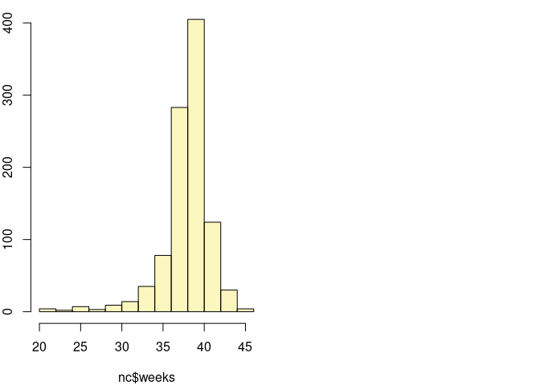
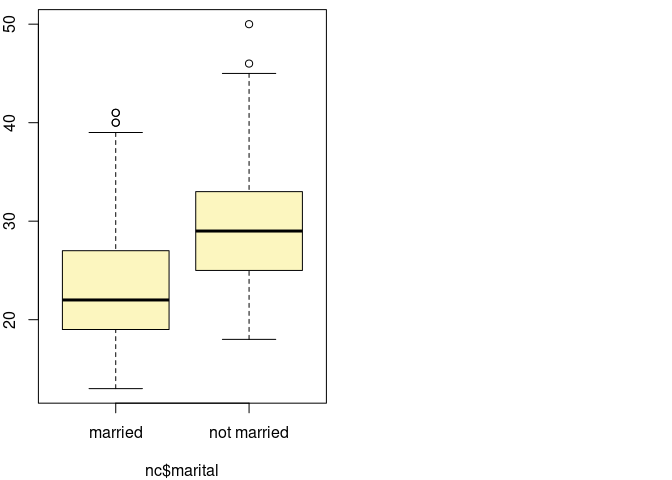

<table>
<tbody>
<tr class="odd">
<td><strong>Disciplina</strong></td>
<td>:CD001-Estatística</td>
</tr>
<tr class="even">
<td><strong>Professora</strong></td>
<td>:Lisiane Selau</td>
</tr>
<tr class="odd">
<td><strong>Aluno</strong></td>
<td>:Strauss Cunha Carvalho</td>
</tr>
<tr class="even">
<td><strong>Labarotório</strong></td>
<td>:LAB-05</td>
</tr>
<tr class="odd">
<td><strong>Data</strong></td>
<td>:26/03/2022</td>
</tr>
</tbody>
</table>

##### **Github do Laboratório 05 - Markdown**

-   \[Github\]
    (<https://github.com/stra-uss/ufrgs-posgrad/blob/main/cd001-statistics/ufrgs-estatistica-strauss-lab05.md>)

##### **Laboratório 5 - LAB-05**

-   Carregamento (ou instalação de R Packages necessários)

<!-- -->

    #install.packages("ggplot2")
    #install.packages("dplyr")
    #install.packages("gridExtra")
    library(ggplot2)
    library(dplyr, warn.conflicts = FALSE)
    library("gridExtra", warn.conflicts = FALSE)

-   Carregamento dos Datasets

<!-- -->

    download.file("http://www.openintro.org/stat/data/nc.RData", destfile = "nc.RData")
    load("nc.RData")

-   Pré-visualização dos tipos de variáveis dataset

<!-- -->

    str(nc)

    ## 'data.frame':    1000 obs. of  13 variables:
    ##  $ fage          : int  NA NA 19 21 NA NA 18 17 NA 20 ...
    ##  $ mage          : int  13 14 15 15 15 15 15 15 16 16 ...
    ##  $ mature        : Factor w/ 2 levels "mature mom","younger mom": 2 2 2 2 2 2 2 2 2 2 ...
    ##  $ weeks         : int  39 42 37 41 39 38 37 35 38 37 ...
    ##  $ premie        : Factor w/ 2 levels "full term","premie": 1 1 1 1 1 1 1 2 1 1 ...
    ##  $ visits        : int  10 15 11 6 9 19 12 5 9 13 ...
    ##  $ marital       : Factor w/ 2 levels "married","not married": 1 1 1 1 1 1 1 1 1 1 ...
    ##  $ gained        : int  38 20 38 34 27 22 76 15 NA 52 ...
    ##  $ weight        : num  7.63 7.88 6.63 8 6.38 5.38 8.44 4.69 8.81 6.94 ...
    ##  $ lowbirthweight: Factor w/ 2 levels "low","not low": 2 2 2 2 2 1 2 1 2 2 ...
    ##  $ gender        : Factor w/ 2 levels "female","male": 2 2 1 2 1 2 2 2 2 1 ...
    ##  $ habit         : Factor w/ 2 levels "nonsmoker","smoker": 1 1 1 1 1 1 1 1 1 1 ...
    ##  $ whitemom      : Factor w/ 2 levels "not white","white": 1 1 2 2 1 1 1 1 2 2 ...

-   Pré-visualização de uma pequena amostra do dataset

<!-- -->

    head(nc, 5)

    ##   fage mage      mature weeks    premie visits marital gained weight
    ## 1   NA   13 younger mom    39 full term     10 married     38   7.63
    ## 2   NA   14 younger mom    42 full term     15 married     20   7.88
    ## 3   19   15 younger mom    37 full term     11 married     38   6.63
    ## 4   21   15 younger mom    41 full term      6 married     34   8.00
    ## 5   NA   15 younger mom    39 full term      9 married     27   6.38
    ##   lowbirthweight gender     habit  whitemom
    ## 1        not low   male nonsmoker not white
    ## 2        not low   male nonsmoker not white
    ## 3        not low female nonsmoker     white
    ## 4        not low   male nonsmoker     white
    ## 5        not low female nonsmoker not white

#### **Tarefas**

##### 1. Calcule o intervalo de confiança de 95% para a duração média das gravidezes (weeks) e o interprete no contexto do conjunto de dados. Perceba que, uma vez que você está realizando uma inferência sobre um único parâmetro populacional, não há nenhuma variáveis explanatória, e portanto você pode omitir a variável x da função.

-   Calculando o intervalo de confiança de 95%, para a variável tempo
    (em semanas) de gestação, por meio da função inference, no R,
    gerou-se um intervalo ede 38.15 até 38.51 semanas de gestação.

<!-- -->

    inference(y = nc$weeks, est = "mean", type = "ci",  conflevel = 0.95,
              alternative = "twosided", method = "theoretical")

    ## Single mean 
    ## Summary statistics:

    ## mean = 38.3347 ;  sd = 2.9316 ;  n = 998 
    ## Standard error = 0.0928 
    ## 95 % Confidence interval = ( 38.1528 , 38.5165 )

##### 2. Calcule um novo intervalo de confiança para o mesmo parâmetro com nível de confiança de 90%. Você pode mudar o nível de confiança adicionando um novo argumento à função: conflevel =0.90.

-   Calculando o intervalo de confiança de 90%, para a variável tempo
    (em semanas) de gestação, por meio da função inference, no R,
    gerou-se um intervalo ede 38.18 até 38.43 semanas de gestação.

<!-- -->

    inference(y = nc$weeks, est = "mean", type = "ci",  conflevel = 0.9,
              alternative = "twosided", method = "theoretical")

    ## Single mean 
    ## Summary statistics:

    ## mean = 38.3347 ;  sd = 2.9316 ;  n = 998 
    ## Standard error = 0.0928 
    ## 90 % Confidence interval = ( 38.182 , 38.4873 )

##### 3. Realize um teste de hipótese para avaliar se o a média do peso ganho pelas mães mais jovens é diferente da média de peso ganho pelas mães mais velhas.

    younger = nc[nc$mature == "younger mom", ]
    older = nc[nc$mature == "mature mom", ]

    t.test(younger$weight, older$weight ,alternative=c("two.sided"),var.equal=F, conf.level=0.9)

    ## 
    ##  Welch Two Sample t-test
    ## 
    ## data:  younger$weight and older$weight
    ## t = -0.18584, df = 166.08, p-value = 0.8528
    ## alternative hypothesis: true difference in means is not equal to 0
    ## 90 percent confidence interval:
    ##  -0.2804968  0.2238326
    ## sample estimates:
    ## mean of x mean of y 
    ##  7.097232  7.125564

##### 4. Agora, um tarefa não-inferencial: determine o ponto de corte da idade das mães jovens e maduras. Utilize um método da sua escolha, e explique como seu método funciona.

    younger_age = nc[nc$mage <= 40, ]
    older_age = nc[nc$mage >= 41, ]

##### 5. Escolha um par de variáveis, sendo uma numérica e outra categorial, e desenvolva um pergunta de pesquisa para avaliar a relação entre essas variáveis. Formule a questão de maneira que ela possa ser respondida utilizando um teste de hipótese e/ou um intervalo de confiança. Responda a sua questão utilizando a função inference, informe os resultados estatísticos, e também elabora uma explicação em linguagem simples.

-   Calculando o intervalo de confiança de 95%, utilizando-se as
    variáveis estado civil x idade, por meio da função inference, no R,
    gerou-se um intervalo ede 38.15 até 38.51 semanas de gestação.

<!-- -->

    inference(x = nc$marital ,y = nc$mage, est = "mean", type = "ci",  conflevel = 0.95,
              alternative = "twosided", method = "theoretical")

    ## Response variable: numerical, Explanatory variable: categorical
    ## Difference between two means
    ## Summary statistics:
    ## n_married = 386, mean_married = 23.5622, sd_married = 5.658
    ## n_not married = 613, mean_not married = 29.1419, sd_not married = 5.524

    ## Observed difference between means (married-not married) = -5.5797
    ## 
    ## Standard error = 0.3643 
    ## 95 % Confidence interval = ( -6.2938 , -4.8657 )

#### Exercícios Aula 4

##### 1. Fazer exercícios 1 e 2 dos slides 15, 18 e 22. Utilize os três exemplos feitos em aula como referência (para resolver e interpretar).

##### Slide 15

###### Exercício 1: Para testar a performance em termos de consumo de combustível de um novo carro compacto, o fabricante sorteou seis motoristas profissionais que dirigiram o automóvel de Pelotas a Porto Alegre. O consumo do carro (em litros) para cada um dos seis motoristas foi de: - 27,2; - 29,3; - 31,5; - 28,7; - 30,2; - 29,6.

###### Baseado nesses dados e utilizando nível de significância de 5%, o fabricante pode indicar que o consumo médio do novo carro é de 30 litros para viagens nesse percurso?

-   *H*0 : *μ* = 30

-   *H*1 : *μ* ≠ 30

-   Testando a normalidade:

<!-- -->

    consumo <- c(27.2, 29.3, 31.5, 28.7, 30.2, 29.6)
    shapiro.test(consumo)

    ## 
    ##  Shapiro-Wilk normality test
    ## 
    ## data:  consumo
    ## W = 0.98952, p-value = 0.988

-   Aplicando o Teste T:

<!-- -->

    mi0 <- 30
    t.test(consumo, mu = mi0, conf.level = 0.95)

    ## 
    ##  One Sample t-test
    ## 
    ## data:  consumo
    ## t = -0.9894, df = 5, p-value = 0.3679
    ## alternative hypothesis: true mean is not equal to 30
    ## 95 percent confidence interval:
    ##  27.90109 30.93224
    ## sample estimates:
    ## mean of x 
    ##  29.41667

-   T-crítico (0.025)

<!-- -->

    qt(0.025,df=5, lower.tail = T)

    ## [1] -2.570582

-   t-calculado = -0.9894
-   t-crítico = -2.57
-   p-valor = 0.3679 com alfa = 0.05, sendo p-value &gt; alfa, então
    aceita-se H0.
-   Os valores de 27.9 até 30.93 compreendem o intervalo de confiança de
    95%. Assim, incluindo, neste intervalo, o valor de 30 litros.

###### Exercício 2: O Instituto de Nutrição da América Central e Panamá fez um estudo intensivo de resultados de dietas publicados em revistas científicas. Uma dieta aplicada a 15 pessoas produziu os seguintes níveis de colesterol (em mg/l):

    dieta <- c(204, 108, 140, 152, 158, 129, 175, 146, 157, 174, 192, 194, 144, 152, 135)

##### Sabendo-se que o nível médio normal de colesterol é de 190 mg/l, verifique se a redução no teor médio de colesterol das pessoas submetidas a essa dieta foi significativa, com alfa=0,05.

-   *H*0 : *μ* = 190*m**g*/*l*

-   *H*1 : *μ* ≠ 190*m**g*/*l*

-   Testando a normalidade:

<!-- -->

    shapiro.test(dieta)

    ## 
    ##  Shapiro-Wilk normality test
    ## 
    ## data:  dieta
    ## W = 0.96974, p-value = 0.8541

-   Aplicando o Teste T (Teste Unilateral - Parâmetro less):

<!-- -->

    mi0 <- 190
    t.test(dieta, alternative = 'less', mu = mi0, conf.level = 0.95)

    ## 
    ##  One Sample t-test
    ## 
    ## data:  dieta
    ## t = -4.8032, df = 14, p-value = 0.0001404
    ## alternative hypothesis: true mean is less than 190
    ## 95 percent confidence interval:
    ##      -Inf 169.3121
    ## sample estimates:
    ## mean of x 
    ##  157.3333

-   T-crítico (0.025)

<!-- -->

    qt(0.025,df=14, lower.tail = T)

    ## [1] -2.144787

-   t-calculado = - 4.8032
-   t-crítico = -2.144787
-   p-valor = 0.00001404 com alfa = 0.05, sendo P &lt; alfa, então
    rejeita-se H0

##### Slide 18

###### Os dados abaixo dão os acertos obtidos por oito soldados num experimento destinado a determinar se a precisão do tiro é afetada pela maneira de dispor os olhos: com o olho direito aberto ou com o olho esquerdo aberto. Que conclusão você poderia tirar, com alfa = 0,05?

    soldier_01 <- c(44, 39, 33, 56, 43, 56, 47, 58)
    soldier_02 <- c(40, 37, 28, 53, 48 ,51, 45, 60)

-   *H*0 : *μ**x* = *μ**y*(*μ**d*=0)

-   *H*1 : *μ**x* ≠ *μ**y*(*μ**d*≠0)

-   Testando a normalidade das duas amostras

<!-- -->

    shapiro.test(soldier_01)

    ## 
    ##  Shapiro-Wilk normality test
    ## 
    ## data:  soldier_01
    ## W = 0.92726, p-value = 0.4914

    shapiro.test(soldier_02)

    ## 
    ##  Shapiro-Wilk normality test
    ## 
    ## data:  soldier_02
    ## W = 0.98837, p-value = 0.9922

-   Aplicando o Teste T Pareado:

<!-- -->

    t.test(soldier_01, soldier_02, paired=T)

    ## 
    ##  Paired t-test
    ## 
    ## data:  soldier_01 and soldier_02
    ## t = 1.4, df = 7, p-value = 0.2042
    ## alternative hypothesis: true difference in means is not equal to 0
    ## 95 percent confidence interval:
    ##  -1.20578  4.70578
    ## sample estimates:
    ## mean of the differences 
    ##                    1.75

-   T-crítico (0.025)

<!-- -->

    qt(0.025,df=7, lower.tail = T)

    ## [1] -2.364624

-   t-calculado = 1.4
-   t-crítico = -2.364624
-   p-valor = 0.2042 com alfa =0.05, endo P &gt; alfa, então aceita-se
    H0

###### Tendo interesse em estudar os efeitos de determinada dieta alimentar sobre o aumento do peso corporal em cobaias adultas, um investigador tomou uma amostra de 9 cobaias. Determinou seus pesos antes e três meses após a administração da nova dieta. Com os dados a seguir, analise o efeito da nova dieta, par alfa = 0,05.

    dieta_01 <- c(54, 61, 50, 74, 79, 58, 55, 49, 63)
    dieta_02 <- c(57, 66, 53, 73, 82, 58, 56, 53, 63)

-   *H*0 : *μ**x* = *μ**y*(*μ**d*=0)

-   *H*1 : *μ**x* ≠ *μ**y*(*μ**d*≠0)

-   Testando a normalidade das duas amostras

<!-- -->

    shapiro.test(dieta_01)

    ## 
    ##  Shapiro-Wilk normality test
    ## 
    ## data:  dieta_01
    ## W = 0.90689, p-value = 0.2947

    shapiro.test(dieta_02)

    ## 
    ##  Shapiro-Wilk normality test
    ## 
    ## data:  dieta_02
    ## W = 0.87847, p-value = 0.1513

-   Aplicando o Teste T pareado:

<!-- -->

    t.test(dieta_01, dieta_02, paired=T)

    ## 
    ##  Paired t-test
    ## 
    ## data:  dieta_01 and dieta_02
    ## t = -2.9104, df = 8, p-value = 0.01958
    ## alternative hypothesis: true difference in means is not equal to 0
    ## 95 percent confidence interval:
    ##  -3.5846498 -0.4153502
    ## sample estimates:
    ## mean of the differences 
    ##                      -2

-   T-crítico (0.025)

<!-- -->

    qt(0.025,df=8, lower.tail = T)

    ## [1] -2.306004

-   t-calculado = -2.9104
-   t-crítico = -2.306004
-   p-valor = 0.01958 com alfa = 0.05, então rejeita-se H0

##### Slide 22

###### Para verificar o grau de adesão de uma nova cola para vidros, preparam-se dois tipos de montagem; cruzado (A), onde a cola é posta em forma de X, e quadrado (B), onde a fórmula é posta nas 4 bordas. O resultado para a resistência das duas amostras está abaixo. Para um nível de 5% de significância que tipo de conclusão poderia ser tirada?

    metodo_a <- c(16, 14, 19, 18, 19, 20, 15, 18, 17, 18)
    metodo_b <- c(13, 19, 14, 17, 21, 24, 10, 14, 13, 15)

-   *H*0 : *μ**x* = *μ**y*(*μ**d*=0)

-   *H*1 : *μ**x* ≠ *μ**y*(*μ**d*≠0)

-   Testando a normalidade das duas amostras

<!-- -->

    shapiro.test(metodo_a)

    ## 
    ##  Shapiro-Wilk normality test
    ## 
    ## data:  metodo_a
    ## W = 0.94181, p-value = 0.5733

    shapiro.test(metodo_b)

    ## 
    ##  Shapiro-Wilk normality test
    ## 
    ## data:  metodo_b
    ## W = 0.94277, p-value = 0.5842

-   Aplicando o Teste T:

<!-- -->

    t.test(metodo_a,metodo_b,alternative=c("two.sided"),var.equal=F, conf.level=0.9)

    ## 
    ##  Welch Two Sample t-test
    ## 
    ## data:  metodo_a and metodo_b
    ## t = 0.95258, df = 12.462, p-value = 0.3589
    ## alternative hypothesis: true difference in means is not equal to 0
    ## 90 percent confidence interval:
    ##  -1.211357  4.011357
    ## sample estimates:
    ## mean of x mean of y 
    ##      17.4      16.0

-   T-crítico (0.025)

<!-- -->

    qt(0.025,df=12, lower.tail = T)

    ## [1] -2.178813

-   t-calculado = 1.1813

-   t-crítico = -2.178813

-   p-valor = 0.3589 com alfa = 0.05, sendo p &gt; alfa, então aceita-se
    H0

-   Aplicando o Teste F:

<!-- -->

    var.test(metodo_a,metodo_b,alternative=c("two.sided"),var.equal=F, conf.level=0.9)

    ## 
    ##  F test to compare two variances
    ## 
    ## data:  metodo_a and metodo_b
    ## F = 0.2, num df = 9, denom df = 9, p-value = 0.02507
    ## alternative hypothesis: true ratio of variances is not equal to 1
    ## 90 percent confidence interval:
    ##  0.06291498 0.63577862
    ## sample estimates:
    ## ratio of variances 
    ##                0.2

-   F-crítico (0.025)

<!-- -->

    qt(0.025,df=9, lower.tail = T)

    ## [1] -2.262157

-   f-calculado = 0.2
-   f-crítico = -2.178813
-   p-valor = 0.02507 com alfa = 0.05, sendo p &gt; alfa, então
    rejeita-se H0

###### A fim de comparar a eficácia de dois operários, foram tomadas, para cada um, sete medidas do tempo gasto, em segundos, para realizar certa operação. Os resultados obtidos são dados a seguir. Pergunta-se se, ao nível de5% de significância, os operários devem ser considerados igualmente eficazes ou não.

    operario_a <- c(35, 32, 40, 36, 35, 32,33)
    operario_b <- c(29, 35, 36, 34, 30, 33, 31)

-   *H*0 : *μ**x* = *μ**y*(*μ**d*=0)

-   *H*1 : *μ**x* ≠ *μ**y*(*μ**d*≠0)

-   Testando a normalidade das duas amostras

<!-- -->

    shapiro.test(operario_a)

    ## 
    ##  Shapiro-Wilk normality test
    ## 
    ## data:  operario_a
    ## W = 0.88512, p-value = 0.2502

    shapiro.test(operario_b)

    ## 
    ##  Shapiro-Wilk normality test
    ## 
    ## data:  operario_b
    ## W = 0.95154, p-value = 0.7437

-   Aplicando o Teste T Pareado:

<!-- -->

    t.test(operario_b,operario_b,alternative=c("two.sided"),var.equal=F, conf.level=0.9)

    ## 
    ##  Welch Two Sample t-test
    ## 
    ## data:  operario_b and operario_b
    ## t = 0, df = 12, p-value = 1
    ## alternative hypothesis: true difference in means is not equal to 0
    ## 90 percent confidence interval:
    ##  -2.511947  2.511947
    ## sample estimates:
    ## mean of x mean of y 
    ##  32.57143  32.57143

-   T-crítico (0.025)

<!-- -->

    qt(0.025,df=6, lower.tail = T)

    ## [1] -2.446912

-   t-calculado = 1.7516
-   t-crítico = 2.446912
-   p-valor = 0.1304 com alfa = 0.05, sendo p &gt; alfa, então aceita-se
    H0
