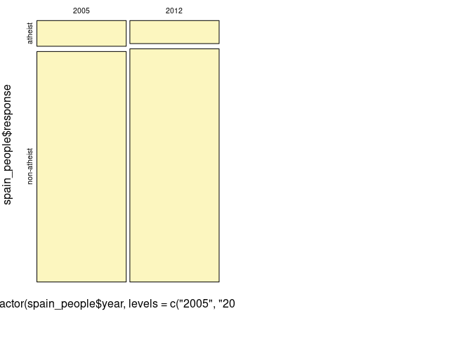
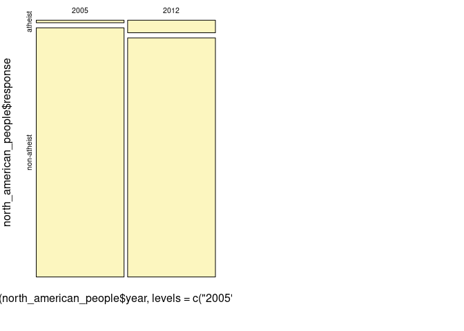

<table>
<tbody>
<tr class="odd">
<td><strong>Disciplina</strong></td>
<td>:CD001-Estatística</td>
</tr>
<tr class="even">
<td><strong>Professora</strong></td>
<td>:Lisiane Selau</td>
</tr>
<tr class="odd">
<td><strong>Aluno</strong></td>
<td>:Strauss Cunha Carvalho</td>
</tr>
<tr class="even">
<td><strong>Labarotório</strong></td>
<td>:LAB-06</td>
</tr>
<tr class="odd">
<td><strong>Data</strong></td>
<td>:01/04/2022</td>
</tr>
</tbody>
</table>

##### **Github do Laboratório 06 - Markdown**

-   \[Github\]
    (<https://github.com/stra-uss/ufrgs-posgrad/blob/main/cd001-statistics/ufrgs-estatistica-strauss-lab06.md>)

##### **Laboratório 6 - LAB-06**

-   Carregamento (ou instalação de R Packages necessários)

<!-- -->

    #install.packages("ggplot2")
    #install.packages("dplyr")
    #install.packages("gridExtra")
    library(ggplot2)
    library(dplyr, warn.conflicts = FALSE)
    library("gridExtra", warn.conflicts = FALSE)

-   Carregamento dos Datasets

<!-- -->

    download.file("http://www.openintro.org/stat/data/atheism.RData", destfile = "atheism.RData")
    load("atheism.RData")

-   Pré-visualização dos tipos de variáveis dataset

<!-- -->

    str(atheism)

    ## 'data.frame':    88032 obs. of  3 variables:
    ##  $ nationality: Factor w/ 57 levels "Afghanistan",..: 1 1 1 1 1 1 1 1 1 1 ...
    ##  $ response   : Factor w/ 2 levels "atheist","non-atheist": 2 2 2 2 2 2 2 2 2 2 ...
    ##  $ year       : int  2012 2012 2012 2012 2012 2012 2012 2012 2012 2012 ...

-   Pré-visualização de uma pequena amostra do dataset

<!-- -->

    head(atheism, 5)

    ##   nationality    response year
    ## 1 Afghanistan non-atheist 2012
    ## 2 Afghanistan non-atheist 2012
    ## 3 Afghanistan non-atheist 2012
    ## 4 Afghanistan non-atheist 2012
    ## 5 Afghanistan non-atheist 2012

#### **Tarefas**

#### A questão sobre o ateísmo foi também feita pelo WIN-Gallup International numa pesquisa de opinião parecida realizada em 2005. A Tabela 4 na página 13 do relatório resume os resultados da pesquisa de 2005 a 2012 em 29 países.

##### 1. Responda às duas perguntas seguintes utilizando a função inference. Como sempre, descreva as hipóteses para qualquer teste que você realizar e esboce sobre as condições para inferência.

-   Dividindo em dois subconjuntos (espanha e estados unidos)

<!-- -->

    spain_people = atheism[atheism$nationality == "Spain", ]
    north_american_people = atheism[atheism$nationality == "United States", ]

-   Função inference para o subconjunto de pessoas da Espanha

<!-- -->

    inference(y = spain_people$response,  x = factor(spain_people$year, levels = c("2005","2012")), est = "proportion", type = "ci",  conflevel = 0.95, method = "theoretical", success = "atheist")

    ## Response variable: categorical, Explanatory variable: categorical
    ## Two categorical variables
    ## Difference between two proportions -- success: atheist
    ## Summary statistics:
    ##              x
    ## y             2005 2012  Sum
    ##   atheist      115  103  218
    ##   non-atheist 1031 1042 2073
    ##   Sum         1146 1145 2291

    ## Observed difference between proportions (2005-2012) = 0.0104
    ## 
    ## Check conditions:
    ##    2005 : number of successes = 115 ; number of failures = 1031 
    ##    2012 : number of successes = 103 ; number of failures = 1042 
    ## Standard error = 0.0123 
    ## 95 % Confidence interval = ( -0.0136 , 0.0344 )

-   Função inference para o subconjunto de pessoas dos Estados Unidos

<!-- -->

    inference(y = north_american_people$response,  x = factor(north_american_people$year, levels = c("2005","2012")), est = "proportion", type = "ci",  conflevel = 0.95, method = "theoretical", success = "atheist")

    ## Response variable: categorical, Explanatory variable: categorical
    ## Two categorical variables
    ## Difference between two proportions -- success: atheist
    ## Summary statistics:
    ##              x
    ## y             2005 2012  Sum
    ##   atheist       10   50   60
    ##   non-atheist  992  952 1944
    ##   Sum         1002 1002 2004

    ## Observed difference between proportions (2005-2012) = -0.0399
    ## 
    ## Check conditions:
    ##    2005 : number of successes = 10 ; number of failures = 992 
    ##    2012 : number of successes = 50 ; number of failures = 952 
    ## Standard error = 0.0076 
    ## 95 % Confidence interval = ( -0.0547 , -0.0251 )

-   1.  Há evidência convincente de que a Espanha teve uma mudança em
        seu índice de ateísmo entre 2005 e 2012?

-   Dica: Crie um novo conjunto de dados para os respondentes da
    Espanha. Depois, utilize suas respostas como a primeira entrada na
    função inference, e utilize a variável year (ano) para definir os
    grupos.

    -   R: Visualmente, pelo gráfico box-plot, não se observa um
        aumento, na espanha, do ateísmo no período de 2005 a 2012.

-   1.  Há evidência convincente de que os Estados Unidos tiveram uma
        mudança em seu índice de ateísmo entre 2005 e 2012?

-   R: Visualmente, pelo gráfico box-plot, se observa um aumento, nos
    estados unidos, do ateísmo no período de 2005 a 2012.

##### 2. Se de fato não houve nenhuma mudança no índice de ateísmo nos países listados na Tabela 4, em quantos países você esperar detectar uma mudança (com um nível de significância de 0,05) simplesmente por acaso?

-   Dica: Procure no índice do livro sobre erros do tipo 1

-   R: Por ANOVA

<!-- -->

    aj <- aov(lm(year ~ response, atheism))
    aj

    ## Call:
    ##    aov(formula = lm(year ~ response, atheism))
    ## 
    ## Terms:
    ##                  response Residuals
    ## Sum of Squares      515.7 1043041.1
    ## Deg. of Freedom         1     88030
    ## 
    ## Residual standard error: 3.442194
    ## Estimated effects may be unbalanced

    lapply(atheism[c('response', 'nationality')], unique)

    ## $response
    ## [1] non-atheist atheist    
    ## Levels: atheist non-atheist
    ## 
    ## $nationality
    ##  [1] Afghanistan                                 
    ##  [2] Argentina                                   
    ##  [3] Armenia                                     
    ##  [4] Australia                                   
    ##  [5] Austria                                     
    ##  [6] Azerbaijan                                  
    ##  [7] Belgium                                     
    ##  [8] Bosnia and Herzegovina                      
    ##  [9] Brazil                                      
    ## [10] Bulgaria                                    
    ## [11] Cameroon                                    
    ## [12] Canada                                      
    ## [13] China                                       
    ## [14] Colombia                                    
    ## [15] Czech Republic                              
    ## [16] Ecuador                                     
    ## [17] Fiji                                        
    ## [18] Finland                                     
    ## [19] France                                      
    ## [20] Georgia                                     
    ## [21] Germany                                     
    ## [22] Ghana                                       
    ## [23] Hong Kong                                   
    ## [24] Iceland                                     
    ## [25] India                                       
    ## [26] Iraq                                        
    ## [27] Ireland                                     
    ## [28] Italy                                       
    ## [29] Japan                                       
    ## [30] Kenya                                       
    ## [31] Korea, Rep (South)                          
    ## [32] Lebanon                                     
    ## [33] Lithuania                                   
    ## [34] Macedonia                                   
    ## [35] Malaysia                                    
    ## [36] Moldova                                     
    ## [37] Netherlands                                 
    ## [38] Nigeria                                     
    ## [39] Pakistan                                    
    ## [40] Palestinian territories (West Bank and Gaza)
    ## [41] Peru                                        
    ## [42] Poland                                      
    ## [43] Romania                                     
    ## [44] Russian Federation                          
    ## [45] Saudi Arabia                                
    ## [46] Serbia                                      
    ## [47] South Africa                                
    ## [48] South Sudan                                 
    ## [49] Spain                                       
    ## [50] Sweden                                      
    ## [51] Switzerland                                 
    ## [52] Tunisia                                     
    ## [53] Turkey                                      
    ## [54] Ukraine                                     
    ## [55] United States                               
    ## [56] Uzbekistan                                  
    ## [57] Vietnam                                     
    ## 57 Levels: Afghanistan Argentina Armenia Australia Austria ... Vietnam

##### 3. Suponha que você foi contratado pelo governo local para estimar a proporção de residentes que participam de cultos religiosos semanalmente. De acordo com diretrizes, a estimativa deve ter uma margem de erro inferior a 1% com nível de confiança de 95%. Você não tem nenhuma noção de que valor supor para p. Quanto pessoas você teria que amostrar para garantir que você está dentro das diretrizes?

-   Dica: Retome seu gráfico da relação entre p e a margem de erro. Não
    use o conjunto de dados para responder a essa questão.

<!-- -->

    n = (1.96^2) * (0.5*(1-0.5))/(0.01^2)
    n

    ## [1] 9604

-   R: Seriam necessárias 9.604 pessoas

##### 4. Exercícios Aula 5

-   Fazer exercícios do slide 17.

-   Utilize os três exemplos feitos em aula como referência (para
    resolver e interpretar).

<!-- -->

    prop.test(x=c(500,505),n=c(44925,44910),alternative="two.sided",correct = F,conf.level = 0.95)

    ## 
    ##  2-sample test for equality of proportions without continuity
    ##  correction
    ## 
    ## data:  c(500, 505) out of c(44925, 44910)
    ## X-squared = 0.026874, df = 1, p-value = 0.8698
    ## alternative hypothesis: two.sided
    ## 95 percent confidence interval:
    ##  -0.001490590  0.001260488
    ## sample estimates:
    ##     prop 1     prop 2 
    ## 0.01112966 0.01124471

##### Exercício 1: Um fabricante garante que 90% dos equipamentos que fornece a uma fábrica estão de acordo com as especificações exigidas. O exame de uma amostra de 200 peças desse equipamento revelou 25 defeituosas. Obtenha o intervalo de confiança de 95% para a proporção de equipamentos defeituosos e teste a garantiado fabricante

    #IC
    n1 = 200
    x1 = 180
    n2 = 200
    x2 = 175
    phat1 = x1/n1
    phat2 = x2/n2

    SE = sqrt((phat1*(1-phat1)/n1)+(phat2*(1-phat2)/n2))
    (phat1-phat2)- + c(-1, 1)*qnorm(.975)*SE

    ## [1]  0.08688258 -0.03688258

-   R: O IC está entre 0.086 e -0.036

##### Exercício 2: Em uma pesquisa de opinião, 32 dentre 80 homens declararam apreciar certa revista, acontecendo o mesmo com 26 dentre 50 mulheres. Ao nível de 5% de significância os homens e as mulheres apreciam igualmente a revista?

m 26 24 50  
h 32 48 80

    prop.test(x=c(26,32),n=c(50,80),alternative="two.sided",correct = F,conf.level = 0.95)

    ## 
    ##  2-sample test for equality of proportions without continuity
    ##  correction
    ## 
    ## data:  c(26, 32) out of c(50, 80)
    ## X-squared = 1.7931, df = 1, p-value = 0.1805
    ## alternative hypothesis: two.sided
    ## 95 percent confidence interval:
    ##  -0.05521683  0.29521683
    ## sample estimates:
    ## prop 1 prop 2 
    ##   0.52   0.40

##### Exercício 3: A tabela abaixo resume os resultados de uma pesquisa da Pew Research. Gostaríamos de determinar se há realmente diferenças nas classificações de aprovação de Obama, democratas no Congresso e republicanos no Congresso. Utilizando nível de significância de 5%, teste as hipóteses:

-   H 0 : Não há diferença nas classificações de aprovação entre os três
    grupos.
-   H 1 : Existe alguma diferença nas classificações de aprovação entre
    os três grupos.

<!-- -->

    pew_research = matrix(c(842,616,736,646,541,842),nrow=2)
    chisq.test(pew_research)

    ## 
    ##  Pearson's Chi-squared test
    ## 
    ## data:  pew_research
    ## X-squared = 106.35, df = 2, p-value < 2.2e-16

    qchisq(0.05,df=2,lower.tail=FALSE)

    ## [1] 5.991465

    chisq.test(pew_research)$stdres

    ##           [,1]      [,2]     [,3]
    ## [1,]  7.147065  2.790668 -10.0309
    ## [2,] -7.147065 -2.790668  10.0309

-   H0: não há diferenças na classificação de democratas e republicanos
    e Obama
-   H1: existe alguma diferença na classificação de democratas e
    republicanos e Obama
-   Para p P-valor &lt; 0.05, rejeita-se H0
